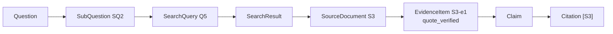
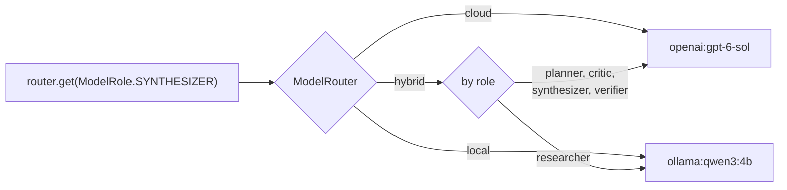

# Agentic Research Engine

A deep-research system built on LangGraph. Give it a research question and it
decomposes the question into sub-questions, runs web searches in parallel,
deduplicates results before spending a single page fetch, extracts evidence as
verbatim quotes checked against the source text, assesses its own coverage,
and researches again if there are gaps — under hard budgets. It then writes a
report in which every claim carries citations, and verifies that each citation
resolves to a source the run actually retrieved.

It runs entirely on OpenAI, entirely on local Ollama models, or in a hybrid
split where high-volume mechanical work runs locally and reasoning runs in the
cloud.

```
                     ┌──────────────────────────────────────────┐
  research question  │  decompose → search → dedupe → fetch →    │   report.md
  ────────────────►  │  extract → assess coverage ─┐             │  ──────────►
                     │        ▲                    │ gaps?       │   + sources
                     │        └────────────────────┘             │   + evidence
                     │  synthesize → verify citations            │   + metrics
                     └──────────────────────────────────────────┘
```

---

## Why this exists

Ask one model a broad research question and you get fluent prose with
confident, frequently fabricated citations. Three failures are bundled
together: no decomposition, no retrieval discipline, and no verification. This
project separates them and addresses each one, then measures whether it
worked.

It is also a deliberate exercise in the parts of agentic systems that are
usually skipped — bounded loops, partial failure, provenance, cost accounting,
and evaluating a system that has no gold answer.

---

## What it actually does

- **Decomposes** a question into 4–6 researchable dimensions, deliberately
  including the angle a naive answer would miss (failure modes, hidden costs).
- **Searches in parallel** with bounded concurrency, and rewrites queries each
  round so follow-ups do not repeat earlier searches.
- **Deduplicates before fetching.** A page found by four sub-questions costs
  one fetch and one extraction call, not four.
- **Extracts evidence as verbatim quotes**, each checked against the source
  text. A quote that cannot be located is flagged, not silently trusted.
- **Preserves disagreement.** Evidence carries a stance, and contradictions
  survive into the report instead of being smoothed into consensus.
- **Assesses its own coverage** using counted facts, then loops on specific
  gaps — under hard limits on rounds, queries, sources and model calls.
- **Verifies its own citations.** Structural checks first, then sampled
  entailment checking of claims against their cited evidence.
- **Reports honestly.** Cost is marked unavailable rather than guessed;
  unverifiable quotes and unresolved citations appear in the output.

---

## Architecture


Blue nodes are fan-in barriers (`defer=True`). The orange node is the only
back-edge, and it is budget-guarded.

### Provenance chain

Every link is stored, not inferred — so any sentence in the report can be
traced back to the exact span of text it came from.



### Model routing



Application code asks for a model by **role**. Configuration decides the
provider. Nothing in the graph imports an SDK.

Full design rationale, including the alternatives that were rejected:
[`docs/ARCHITECTURE.md`](docs/ARCHITECTURE.md).

---

## Install

Requires Python 3.11 or newer.

```bash
git clone https://github.com/NirmalKumar31/agentic-research-engine.git
cd agentic-research-engine

python -m venv .venv
source .venv/bin/activate        # Windows: .venv\Scripts\activate
pip install -e .

cp .env.example .env
```

### Search key (required in every mode)

Web search needs a provider. [Tavily](https://app.tavily.com) has a free tier
that is sufficient for development:

```bash
# .env
TAVILY_API_KEY=tvly-...
```

### Then pick a mode

<details open>
<summary><b>Local — no API key, no per-token cost</b></summary>

```bash
# Install Ollama from https://ollama.com, then:
ollama pull qwen3:4b
ollama serve
```

```bash
# .env
LLM_MODE=local
OLLAMA_MODEL=qwen3:4b
```

Slower and weaker at judgement than a frontier model — see
[measured findings](#what-running-on-a-4b-local-model-taught-us) — but it
works, it is private, and it costs nothing per token.
</details>

<details>
<summary><b>Cloud — fastest and highest quality</b></summary>

```bash
# .env
LLM_MODE=cloud
OPENAI_API_KEY=sk-...
OPENAI_MODEL=gpt-6-sol
OPENAI_FAST_MODEL=gpt-6-luna
```
</details>

<details>
<summary><b>Hybrid — evidence extraction local, reasoning in the cloud</b></summary>

```bash
# .env
LLM_MODE=hybrid
OPENAI_API_KEY=sk-...
OLLAMA_MODEL=qwen3:4b
```

Extraction is the highest-volume role — one call per source — and its job is
quotation rather than judgement, so it runs locally. Planning, critique,
synthesis and verification stay in the cloud.
</details>

### Verify the setup before spending anything

```bash
agentic-research check
```

```
                           Configuration
┏━━━━━━━━━━━━━━━━━┳━━━━━━━━━━━━━━━━━━━━━━━━━━━━━━━━━━━━━━━━━━━━━━━━┓
┃ Check           ┃ Result                                         ┃
┡━━━━━━━━━━━━━━━━━╇━━━━━━━━━━━━━━━━━━━━━━━━━━━━━━━━━━━━━━━━━━━━━━━━┩
│ Mode            │ local                                          │
│   planner       │ ollama:qwen3:4b                                │
│   researcher    │ ollama:qwen3:4b                                │
│   synthesizer   │ ollama:qwen3:4b                                │
│ Search provider │ tavily                                         │
│ Tavily key      │ set                                            │
│ Model preflight │ ok                                             │
│ Budgets         │ 2 rounds, 24 queries, 40 sources, 60 LLM calls │
└─────────────────┴────────────────────────────────────────────────┘
```

---

## Usage

```bash
agentic-research research "Compare modern approaches for detecting fraud in \
highly imbalanced transaction datasets."
```

```bash
# Options
agentic-research research "..." --mode hybrid --max-rounds 3 --verbose
agentic-research research "..." --output report.md --quiet
agentic-research show latest        # re-display a stored run, no re-running
agentic-research graph              # print the Mermaid diagram
agentic-research evaluate -n 2      # run the benchmark (spends credits)
```

Progress streams live as the graph executes. This is a real transcript,
lightly trimmed for width:

```
Researching: Compare modern approaches for detecting fraud in highly
             imbalanced transaction datasets, including how such models
             should be evaluated.
Analysing question...
  intent: compare technical approaches and their evaluation
Research plan: 6 sub-questions
  - What are the most effective machine learning models for fraud detection
    in highly imbalanced transaction datasets?
  - What are the most appropriate evaluation metrics for fraud detection
    models in highly imbalanced datasets?
  - What are the hidden costs and challenges of implementing fraud detection
    models in real-time transaction systems?
  - What security risks and compliance requirements must be considered when
    deploying fraud detection models in financial systems?
  - What are the failure modes and edge cases that could cause fraud
    detection models to miss critical fraud patterns?
  - How does the maturity of fraud detection technologies vary across
    different financial sectors and geographic regions?

Round 1: searching 6 queries
  48 results -> 46 unique (2 duplicate fetches avoided), retrieving 5
  5 usable sources, extracting evidence from 5
  coverage 100% (6 covered, 0 weak, 0 missing) - sufficient
Synthesising from 30 evidence items...
Verifying citations...
  11/11 citations resolve to retrieved sources
Complete (coverage judged sufficient)
```

Note the third and fifth sub-questions: the planner is asked to include the
dimension a naive answer would skip, and it produced hidden costs and failure
modes unprompted.

### Web UI

```bash
pip install -e ".[ui]"
streamlit run app/streamlit_app.py
```

Same engine, same event stream — the UI contains no research logic.

### Docker

```bash
docker build -t agentic-research .
docker run --rm --env-file .env \
  -e OLLAMA_BASE_URL=http://host.docker.internal:11434 \
  -v "$PWD/outputs:/home/researcher/outputs" \
  agentic-research research "..."
```

`localhost` inside a container is the container, so local and hybrid modes
need `OLLAMA_BASE_URL` pointed at the host. CI builds the image and runs the
CLI inside it on every push.

### Output artifacts

```
outputs/<run_id>/
    report.md        rendered report with citations and verification footer
    sources.json     every source, quality score, fetch status
    evidence.json    every evidence item, its quote, its verification flag
    metrics.json     full metric set
    run.json         plan, queries, coverage history, errors
```

---

## Configuration

Everything is environment-driven; see [`.env.example`](.env.example) for the
annotated full list.

| Variable | Default | What it controls |
|---|---|---|
| `LLM_MODE` | `hybrid` | `cloud`, `local` or `hybrid` |
| `OPENAI_MODEL` / `OPENAI_FAST_MODEL` | `gpt-6-sol` / `gpt-6-luna` | Cloud models for reasoning / high-volume roles |
| `OLLAMA_MODEL` | `qwen3:4b` | Local model |
| `<ROLE>_MODEL` | — | Per-role override, e.g. `CRITIC_MODEL=openai:gpt-6-astra` |
| `ALLOW_CLOUD_FALLBACK` | `false` | Whether a missing local model may fall back to cloud |
| `MAX_RESEARCH_ROUNDS` | `3` | Hard cap on research iterations |
| `MAX_SEARCH_QUERIES` / `MAX_SOURCES` / `MAX_LLM_CALLS` | `24` / `40` / `60` | Hard budgets |
| `MAX_PARALLEL_SEARCHES` / `MAX_PARALLEL_FETCHES` | `5` / `8` | Concurrency limits |
| `MAX_PARALLEL_LOCAL_LLM_CALLS` | `2` | Concurrency against a local model |
| `SEARCH_DEPTH` | `basic` | Tavily depth; escalates on follow-up rounds |
| `CHECKPOINT_BACKEND` | `sqlite` | `sqlite`, `memory` or `none` |

`ALLOW_CLOUD_FALLBACK` defaults to `false` on purpose: if you chose local
mode, an unreachable Ollama should not quietly start spending money.

---

## How the interesting parts work

### Deduplication before fetching

The reason the pipeline fans out per *stage* rather than per *researcher*: a
worker cannot see its siblings, so a page surfaced by four sub-questions would
be downloaded and LLM-processed four times. A barrier between search and fetch
sees every result at once.

URL canonicalisation strips tracking parameters, AMP paths, default ports and
fragments, and sorts query parameters, so all four of these collapse to one
source:

```
https://www.Example.com/post?utm_source=x&id=7#intro
https://example.com/post/?id=7
https://example.com/post?id=7&fbclid=abc
http://example.com:80/post?id=7          (kept distinct: different scheme)
```

Content-hash deduplication runs after fetching to catch syndicated copies at
different URLs. Title similarity is used too, but **differing numbers veto a
merge** — "Part 1"/"Part 2" and the 2024/2025 editions of a report score above
any useful similarity threshold while being genuinely different documents.
That was a real bug caught by a test.

### Evidence, not links

```python
EvidenceItem(
    id="S3-e1",              # unique without coordination: one worker owns S3
    source_id="S3",
    sub_question_id="SQ2",   # why we went looking
    query_id="Q5",           # what found it
    claim="Precision-recall curves are more informative than ROC AUC here.",
    quote="precision-recall curves are a more informative evaluation than "
          "ROC AUC under heavy imbalance",
    stance=Stance.SUPPORTS,
    quote_verified=True,     # the quote was located in the source text
)
```

`quote_verified` is the load-bearing field. It tolerates curly quotes and
reflowed whitespace, and rejects paraphrase. It is what stops a real URL being
cited for a sentence the page never contained.

### Citation verification

1. **Structural** (free, deterministic): does every cited id resolve to a
   source actually retrieved? Does every factual claim carry a citation? Which
   retrieved sources went unused?
2. **Entailment** (sampled, one model call per claim): does the cited evidence
   actually support this claim?

A citation pointing at a source that was never retrieved gets the marker
stripped and the sentence kept — the sentence may be true and merely
mis-cited, but a dangling reference is always wrong. The claim then shows up
as uncited, which is an honest description of its state.

### Bounded loops

```python
if coverage.sufficient:                                 return "synthesize"
if round_number >= budget.max_research_rounds:          return "synthesize"
if len(completed_queries) >= budget.max_search_queries: return "synthesize"
if len(sources) >= budget.max_sources:                  return "synthesize"
```

Termination does not depend on the critic being satisfied. A test rigs the
coverage model to always demand more research; the run still stops at the
round cap and still produces a report.

---

## A measured run

Every number below is from one real execution on 2026-09-22 — live Tavily
search, `qwen3:4b` running locally, no cloud model involved. The artifacts it
produced are the ones described in [Output artifacts](#output-artifacts).

**Question:** *Compare modern approaches for detecting fraud in highly
imbalanced transaction datasets, including how such models should be
evaluated.*

| | |
|---|---|
| Sub-questions planned | 6 |
| Search queries / results | 6 / 48 |
| Unique URLs after deduplication | 46 (2 duplicates collapsed) |
| Sources retrieved | 5 (per-round cap), across **5 distinct domains** |
| Separate page fetches | **0** — all five reused content Tavily already returned |
| Evidence items | 30 |
| **Quotes verified against source** | **30 / 30 (100%)** |
| **Citation validity** | **11 / 11 (100%)** |
| Citation coverage | 100% of factual claims |
| Claims entailed by cited evidence | 60% (sampled) |
| Sources retrieved but never cited | 0 |
| Research rounds | 1 — stopped because coverage was judged sufficient |
| Model calls | 20 (planner 2, researcher 6, critic 1, synthesizer 1, verifier 10) |
| Tokens | 21,540 in / 6,046 out |
| **Cost** | **$0.00** (entirely local) |
| Wall clock | 638s |
| Recoverable errors | 0 |

Sources it selected included an arXiv paper and an MDPI journal article
alongside two industry write-ups — domain concentration 0.20, meaning no
single publisher dominated.

The unedited artifacts from this run are committed under
[`examples/sample-run/`](examples/sample-run/), including the full evidence
chain with every quote and its verification flag.

Two things worth reading honestly rather than as marketing:

- **Deduplication saved little here (2 of 48).** Six genuinely different
  sub-questions return genuinely different pages. The barrier is cheap
  insurance that pays off when sub-questions overlap; a unit test pins the
  mechanism at 3 fetches for 9 results across 3 queries. Quoting the test
  fixture's ratio as a headline number would be dishonest.
- **60% entailment support is the weakest number here**, and it is the local
  model judging its own report. That is a calibration limit of a 4B verifier,
  which is exactly why hybrid mode keeps verification in the cloud.

## What running on a 4B local model taught us

All measured on `qwen3:4b`. These findings shaped the design rather than
merely describing it.

**Prose instructions do not survive a small model; schema fields do.** The
synthesis prompt asked for citation markers like `[S3]` in the claim text. The
model produced a complete, well-organised report containing **zero** markers.
Moving citations into a required `source_ids` schema field fixed it outright,
same model and same question:

| | prose markers | schema field |
|---|---|---|
| Citations emitted | 0 | 9 |
| Citation validity | n/a | 100% |

> If a model must produce something reliably, put it in the schema, not the
> instructions.

**Quotation is reliable; judgement is not.** Asked to extract verbatim
quotes, the model is accurate — 83% quote fidelity on one run and 30/30
(100%) on the live run above. Asked to *judge* whether evidence entails a
claim, it is much weaker: 33% and 60% support rates on those same two runs,
grading its own report. Copying text is easy for a small model; deciding
whether one sentence establishes another is not.

That gap is the empirical basis for the hybrid split — extraction local,
verification in the cloud — rather than an assumption about model size.

**Local models do not parallelise.** Ollama serves one model largely serially.
Fanning eight extraction calls at it produced queueing and read timeouts, not
throughput — hence a separate concurrency limit for local providers.

---

## Testing

```bash
pip install -e ".[dev]"
pytest                    # 202 tests, under 10s, no network, no credentials, no cost
```

Default runs are hermetic. Every external boundary — models, search, page
fetching — is faked or mocked, while the real state machine, reducers,
deduplication and citation verification all execute.

```bash
pytest -m ollama          # against a real local model (free, needs `ollama serve`)
pytest -m integration     # against live Tavily/OpenAI (spends credits)
```

What the suite actually pins down, beyond the obvious:

- the research loop terminates even when the critic is rigged to always demand
  more
- a worker raising an arbitrary exception degrades the run instead of ending it
- an empty search round routes forward instead of silently ending the graph
- budgets are enforced *before* the spend, not reported after
- 9 search results across 3 queries produce exactly 3 fetches
- a fabricated citation is caught, and repair leaves the sentence intact
- URL canonicalisation collapses tracking-parameter variants but not
  differently-numbered editions

## Evaluation

```bash
agentic-research evaluate          # runs the benchmark question set
```

No gold answers — they are expensive, go stale, and mostly measure agreement
with whoever wrote them. Instead each metric asks whether the system did what
it claims:

| Metric | Definition |
|---|---|
| `citation_validity` | Citations resolving to a genuinely retrieved source |
| `citation_coverage` | Factual claims carrying at least one citation |
| `claim_support` | Sampled claims entailed by their cited evidence |
| `quote_fidelity` | Quotes located in their source text |
| `evidence_coverage` | Sub-questions that ended with adequate evidence |
| `source_diversity` | 1 − share held by the single largest domain |
| `duplicate_avoidance` | Results deduplicated before any fetch was spent |
| `unused_source_rate` | Retrieved sources the report never cited |

`citation_validity` is the one that should always be 100%.

### Measured results

Three benchmark questions, `qwen3:4b` running locally with live Tavily
search, 2026-09-22. 3/3 runs succeeded, 58 model calls, 15 sources, $0.00,
mean 971s per question.

| Metric | Mean | B1 | B2 | B3 |
|---|---|---|---|---|
| `citation_validity` | **100%** | 100% | 100% | 100% |
| `citation_coverage` | 100% | 100% | 100% | 100% |
| `evidence_coverage` | 100% | 100% | 100% | 100% |
| `quote_fidelity` | 86.4% | 83% | 76% | 100% |
| `claim_support` | 70.0% | 80% | 70% | 60% |
| `source_diversity` | 68.9% | — | — | — |
| `duplicate_avoidance` | 13.1% | — | — | — |
| `unused_source_rate` | 6.7% | — | — | — |

Reading these honestly:

- **`citation_validity` held at 100% across all three.** No run cited a source
  it had not retrieved. That is the property the citation subsystem exists to
  guarantee, and it is the only one that should never degrade.
- **`quote_fidelity` at 86% means roughly one extracted quote in seven could
  not be located in its source.** Those items are flagged, excluded from
  coverage counting, and down-weighted in confidence — but a larger model
  would do better here, and the number is a property of the 4B model, not of
  the pipeline.
- **`claim_support` at 70% is the weakest figure**, and it is the same local
  model grading its own report. It is a calibration limit as much as a quality
  signal, which is exactly why hybrid mode keeps verification in the cloud.
- **`duplicate_avoidance` at 13% is low**, as expected: distinct sub-questions
  return distinct pages, so the dedup barrier is cheap insurance rather than a
  large saving on these questions.

Reproduce with `agentic-research evaluate -n 3`. Numbers will vary between
runs — the web moves, and the model is sampling.

---

## Limitations

Stated plainly, because a tool that hides these is worse than one that does
not have them.

- **It does not verify truth.** It verifies that claims are faithful to
  retrieved sources. A confident report built on wrong pages will score well.
- **Source quality is a heuristic**, not a measurement. Hand-weighted over
  document type, search rank, length and recency, untuned against ground
  truth. It orders sources for extraction; it is not a claim about
  correctness, and it reports its reasons so you can disagree.
- **PDFs are skipped** as unsupported content. A real gap for academic sources.
- **JavaScript-only pages yield nothing.** They are marked `EMPTY` rather than
  silently counted as read.
- **The factual-claim detector is keyword-based** and will misclassify some
  framing sentences. It only drives warnings, never deletion.
- **Entailment checking is sampled**, not exhaustive, because it costs one
  model call per claim.
- **Local models are meaningfully weaker** at judgement roles — quantified
  above rather than hand-waved.
- **English-centric.** Extraction prompts and quote matching have not been
  tested on other languages.
- **Not a crawler.** It fetches chosen URLs and stops. No link discovery.

## Roadmap

- PDF text extraction (the largest real gap)
- Content cache keyed by canonical URL, shared across runs
- Cross-encoder reranking of evidence before synthesis
- Source-quality weights learned from which sources end up cited
- Postgres checkpointing and a task queue, if this ever runs multi-tenant

---

## Technology

| | |
|---|---|
| Orchestration | LangGraph 1.2 (`StateGraph`, `Send`, `defer`, reducers, checkpointing) |
| Model access | LangChain 1.6 `ChatOpenAI` / `ChatOllama` behind a role router |
| Structured output | Pydantic 2 via `with_structured_output(method="json_schema")` |
| Search | Tavily REST (Brave implemented to prove the abstraction) |
| Content extraction | trafilatura |
| Async HTTP | httpx |
| CLI | Typer + Rich · **UI** Streamlit |
| Config | pydantic-settings · **Logging** structlog |
| Quality | pytest, ruff, mypy (strict), GitHub Actions |

Version floors are real requirements: LangGraph and LangChain 1.x renamed or
removed much of the 0.x surface that most examples online still use.

## Repository layout

```
src/agentic_research/
    config.py            typed settings, role→model resolution, budgets
    models.py            domain types (the provenance chain)
    schemas.py           LLM output schemas — kept separate and deliberately flat
    metrics.py           run metrics
    report.py            markdown rendering
    runner.py            context, lifetimes, streaming, artifacts
    graph/
        state.py         TypedDict state, reducers, runtime context
        workflow.py      graph assembly
        routing.py       conditional edges and loop termination
        prompts.py       all prompts, in one reviewable place
        nodes/           planning · research · critique · reporting
    llm/                 role router, usage accounting, pricing
    search/              provider contract, Tavily, Brave
    retrieval/           URL canonicalisation, fetcher, content extraction
    evidence/            deduplication, quality, store, quote verification
    citations/           citation parsing, validation, repair
    evaluation/          metrics and benchmark harness
app/                     Streamlit UI
tests/                   unit (hermetic) · integration (opt-in)
docs/                    ARCHITECTURE.md · INTERVIEW_GUIDE.md
```

## Documentation

- [`docs/ARCHITECTURE.md`](docs/ARCHITECTURE.md) — how it works and why, with
  the rejected alternatives
- [`docs/INTERVIEW_GUIDE.md`](docs/INTERVIEW_GUIDE.md) — presenting the design
  and its tradeoffs

## Attribution

Independently designed and implemented. The problem space was inspired by
public LangGraph research-assistant projects; no third-party source code was
copied. The
[reference project](https://github.com/Mohamad-Hachem/LangGraph_Research_Assistant_Agent)
that prompted this carries no license, so its code was treated as
non-reusable — its file listing was read, its source was not.

## License

MIT — see [LICENSE](LICENSE).
