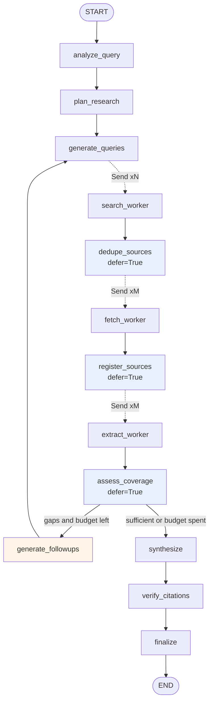
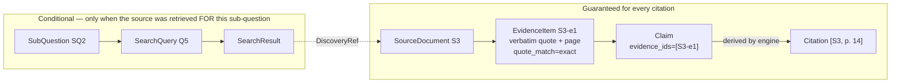
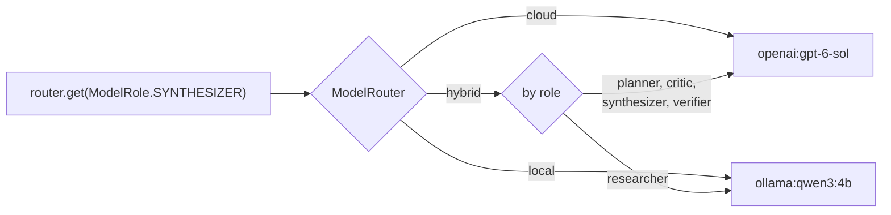

# Agentic Research Engine

A deep-research system built on LangGraph. Give it a research question and it
decomposes the question into sub-questions, runs web searches in parallel,
deduplicates results before spending a single page fetch, extracts evidence as
verbatim quotes checked against the source text, assesses its own coverage,
and researches again if there are gaps — under hard budgets. It then writes a
report in which **every evidence-owing claim** carries engine-derived
citations, and verifies that each one resolves to evidence the run actually
gathered. Framing sentences are marked as such and deliberately carry none.

It runs entirely on OpenAI, entirely on local Ollama models, or in a hybrid
split where high-volume mechanical work runs locally and reasoning runs in the
cloud.

```
                     ┌──────────────────────────────────────────┐
  research question  │  decompose → search → dedupe → fetch →    │   report.md
  ────────────────►  │  extract → assess coverage ─┐             │  ──────────►
                     │        ▲                    │ gaps?       │   + sources
                     │        └────────────────────┘             │   + evidence
                     │  synthesize → verify citations            │   + metrics
                     └──────────────────────────────────────────┘
```

---

## Why this exists

Ask one model a broad research question and you get fluent prose with
confident, frequently fabricated citations. Three failures are bundled
together: no decomposition, no retrieval discipline, and no verification. This
project separates them and addresses each one, then measures whether it
worked.

It is also a deliberate exercise in the parts of agentic systems that are
usually skipped — bounded loops, partial failure, provenance, cost accounting,
and evaluating a system that has no gold answer.

---

## What it actually does

- **Decomposes** a question into 4–6 researchable dimensions, deliberately
  including the angle a naive answer would miss (failure modes, hidden costs).
- **Searches in parallel** with bounded concurrency, and rewrites queries each
  round so follow-ups do not repeat earlier searches.
- **Deduplicates before fetching.** A page found by four sub-questions costs
  one fetch and one extraction call, not four.
- **Extracts evidence as verbatim quotes**, each checked against the source
  text. Only an exact match (after whitespace and punctuation normalisation)
  can support a citation; a reworded near-match is kept for diagnostics and
  explicitly excluded.
- **Reads PDFs with page provenance**, so an academic citation can render
  `[S7, p. 14]` without guessing.
- **Preserves disagreement.** Evidence carries a stance, and contradictions
  survive into the report instead of being smoothed into consensus.
- **Assesses its own coverage** using counted facts, then loops on specific
  gaps — under hard limits on rounds, queries, sources and model calls.
- **Verifies its own citations** against the *exact* evidence behind each
  claim: structural checks first, then entailment — sampled in interactive
  runs, exhaustive in benchmarks, and labelled either way.
- **Refuses unsafe fetches.** Private, loopback, link-local and cloud
  metadata addresses are blocked, and every redirect hop is revalidated.
- **Reports honestly.** Cost is marked unavailable rather than guessed;
  unverifiable quotes and unresolved citations appear in the output.

---

## Architecture



Blue nodes are fan-in barriers (`defer=True`). The orange node is the only
back-edge, and it is budget-guarded.

### Provenance chain

Every link is stored rather than inferred. The chain has two halves, and
they carry different strengths of guarantee — conflating them would
overstate what the system knows.



**Guaranteed.** Every citation resolves to an exact `EvidenceItem`, its
verbatim quote, its page where the source was a PDF, and the
`SourceDocument` it came from. This holds unconditionally: an evidence id
that does not resolve is dropped and reported as an error, so a citation
the reader sees has always been checked.

**Conditional.** The link back to the query and sub-question exists only
when that source was genuinely retrieved on behalf of the sub-question the
evidence answers. Each source is offered to every open sub-question during
extraction, so a finding often addresses a question whose queries never
surfaced that page — **78% of evidence in the last measured run**. Those
items are flagged `cross_attributed` and carry no query id, rather than
borrowing an unrelated one to make the chain look complete.

### Model routing



Application code asks for a model by **role**. Configuration decides the
provider. Nothing in the graph imports an SDK.

Full design rationale, including the alternatives that were rejected:
[`docs/ARCHITECTURE.md`](docs/ARCHITECTURE.md).

---

## Install

Requires Python 3.11 or newer.

```bash
git clone https://github.com/NirmalKumar31/agentic-research-engine.git
cd agentic-research-engine

python -m venv .venv
source .venv/bin/activate        # Windows: .venv\Scripts\activate
pip install -e .

cp .env.example .env
```

### Search key (required in every mode)

Web search needs a provider. [Tavily](https://app.tavily.com) has a free tier
that is sufficient for development:

```bash
# .env
TAVILY_API_KEY=tvly-...
```

### Then pick a mode

<details open>
<summary><b>Local — no API key, no per-token cost</b></summary>

```bash
# Install Ollama from https://ollama.com, then:
ollama pull qwen3:4b
ollama serve
```

```bash
# .env
LLM_MODE=local
OLLAMA_MODEL=qwen3:4b
```

Slower and weaker at judgement than a frontier model — see
[measured findings](#what-running-on-a-4b-local-model-taught-us) — but it
works, it is private, and it costs nothing per token.
</details>

<details>
<summary><b>Cloud — fastest and highest quality</b></summary>

```bash
# .env
LLM_MODE=cloud
OPENAI_API_KEY=sk-...
OPENAI_MODEL=gpt-6-sol
OPENAI_FAST_MODEL=gpt-6-luna
```
</details>

<details>
<summary><b>Hybrid — evidence extraction local, reasoning in the cloud</b></summary>

```bash
# .env
LLM_MODE=hybrid
OPENAI_API_KEY=sk-...
OLLAMA_MODEL=qwen3:4b
```

Extraction is the highest-volume role — one call per source — and its job is
quotation rather than judgement, so it runs locally. Planning, critique,
synthesis and verification stay in the cloud.
</details>

### Verify the setup before spending anything

```bash
agentic-research check
```

```
                           Configuration
┏━━━━━━━━━━━━━━━━━┳━━━━━━━━━━━━━━━━━━━━━━━━━━━━━━━━━━━━━━━━━━━━━━━━┓
┃ Check           ┃ Result                                         ┃
┡━━━━━━━━━━━━━━━━━╇━━━━━━━━━━━━━━━━━━━━━━━━━━━━━━━━━━━━━━━━━━━━━━━━┩
│ Mode            │ local                                          │
│   planner       │ ollama:qwen3:4b                                │
│   researcher    │ ollama:qwen3:4b                                │
│   synthesizer   │ ollama:qwen3:4b                                │
│ Search provider │ tavily                                         │
│ Tavily key      │ set                                            │
│ Model preflight │ ok                                             │
│ Budgets         │ 2 rounds, 24 queries, 40 sources, 60 LLM calls │
└─────────────────┴────────────────────────────────────────────────┘
```

---

## Usage

```bash
agentic-research research "Compare modern approaches for detecting fraud in \
highly imbalanced transaction datasets."
```

```bash
# Options
agentic-research research "..." --mode hybrid --max-rounds 3 --verbose
agentic-research research "..." --output report.md --quiet
agentic-research show latest        # re-display a stored run, no re-running
agentic-research graph              # print the Mermaid diagram
agentic-research evaluate -n 2      # run the benchmark (spends credits)
```

Progress streams live as the graph executes. This is a real transcript,
lightly trimmed for width:

```
Researching: Compare modern approaches for detecting fraud in highly
             imbalanced transaction datasets, including how such models
             should be evaluated.
Analysing question...
  intent: compare technical approaches and their evaluation
Research plan: 6 sub-questions
  - What are the most effective machine learning models for fraud detection
    in highly imbalanced transaction datasets?
  - What are the most appropriate evaluation metrics for fraud detection
    models in highly imbalanced datasets?
  - What are the hidden costs and challenges of implementing fraud detection
    models in real-time transaction systems?
  - What security risks and compliance requirements must be considered when
    deploying fraud detection models in financial systems?
  - What are the failure modes and edge cases that could cause fraud
    detection models to miss critical fraud patterns?
  - How does the maturity of fraud detection technologies vary across
    different financial sectors and geographic regions?

Round 1: searching 6 queries
  48 results -> 46 unique (2 duplicate fetches avoided), retrieving 5
  5 usable sources, extracting evidence from 5
  coverage 100% (6 covered, 0 weak, 0 missing) - sufficient
Synthesising from 30 evidence items...
Verifying citations...
  11/11 citations resolve to retrieved sources
Complete (coverage judged sufficient)
```

Note the third and fifth sub-questions: the planner is asked to include the
dimension a naive answer would skip, and it produced hidden costs and failure
modes unprompted.

### Web UI

```bash
pip install -e ".[web]"
cd web && npm install && npm run build && cd ..
uvicorn agentic_research.web.api:get_asgi_app --factory --reload
# http://127.0.0.1:8000
```

React + Vite frontend served by the same FastAPI process, driving the same
`stream_research` generator as the CLI over Server-Sent Events. The UI
contains no research logic and invents no progress: every line it shows
corresponds to a node that actually ran.

The part worth looking at is the **claim drill-down** — click any citation
marker and it expands the exact evidence behind that sentence: the verbatim
quote, its match class, the page for PDFs, the sub-question it answers, and
a link to the source. Where that source was genuinely retrieved *for* that
sub-question it also shows the query that found it; where it was not, the
item is marked cross-attributed rather than shown a borrowed query. That is
only possible because provenance is evidence-level rather than
source-level.

It also surfaces what is weak rather than hiding it: uncited claims, fuzzy
quotes marked not-citable, contradictions flagged when one side lacks
evidence, and sources retrieved but never cited.

A Streamlit app remains at `app/streamlit_app.py` as a local debugging
interface.

### Hosted demo mode

`DEMO_MODE=true` makes every limit server-controlled. A client value can
only ever make a run **smaller**:

| Guard | Default |
|---|---|
| Rounds / sources / queries / model calls | 1 / 6 / 6 / 20 |
| Cloud spend per run | $0.05, checked before dispatch |
| Search credits per run | 8 |
| Runs per client per hour | 3 |
| Concurrent runs | 2 |
| Wall-clock per run | 240s |
| Query length | 10–300 characters |
| Cloud fallback / persistence / API docs | off |

At capacity it returns an honest, specific reason with `Retry-After`, not a
generic failure. Run slots are released on completion, failure **and client
disconnect**.

### Deploying

```bash
docker build -f Dockerfile.web -t agentic-research-web .
docker run -p 8000:8000 -e DEMO_MODE=true agentic-research-web
```

`render.yaml` is a Render blueprint that declares **no secrets at all**, and
deploys with `LIVE_RESEARCH_ENABLED=false`. Replay needs neither an OpenAI
nor a Tavily key, so the blueprint does not ask for them — every `sync:
false` variable prompts for a value at Blueprint creation, which would have
demanded two credentials for a site that calls neither provider.

To enable live research later: add `OPENAI_API_KEY` and `TAVILY_API_KEY` in
the Render dashboard, then set `LLM_MODE=cloud` and
`LIVE_RESEARCH_ENABLED=true` **together**. Separately is a mistake — there
is no Ollama on a Render instance, so `local` plus live research fails
preflight on the first request.

#### Cold starts

Render's free tier spins a service down after inactivity, so the first
visit after a quiet period takes roughly a minute while the service wakes.
That is the platform behaving as designed, not a fault to work around.

Replay mode is what makes it acceptable: the request that wakes the
service spends no OpenAI and no Tavily credit, so a cold start costs
latency and nothing else. If always-on matters, the answer is a paid
instance rather than synthetic traffic.

#### Why the public site replays instead of running live

The demo's daily run cap lives in process memory, and a host that spins
down resets it on every cold start. It therefore cannot bound an
account-level quota — the per-run request and spend ceilings still hold,
but the daily one does not survive a restart. Rather than add Redis or
Postgres whose only purpose would be letting strangers spend the API
budget, the public instance serves recorded runs and `/api/research`
refuses server-side.

### Output artifacts

```
outputs/<run_id>/
    report.md        rendered report with citations and verification footer
    report.json      structured report: claims, evidence ids, claim kinds
    sources.json     every source, quality score, fetch status
    evidence.json    every evidence item, its quote, its verification flag
    metrics.json     full metric set
    run.json         plan, queries, coverage history, errors
```

---

## Configuration

Everything is environment-driven; see [`.env.example`](.env.example) for the
annotated full list.

| Variable | Default | What it controls |
|---|---|---|
| `LLM_MODE` | `hybrid` | `cloud`, `local` or `hybrid` |
| `OPENAI_MODEL` / `OPENAI_FAST_MODEL` | `gpt-6-sol` / `gpt-6-luna` | Cloud models for reasoning / high-volume roles |
| `OLLAMA_MODEL` | `qwen3:4b` | Local model |
| `<ROLE>_MODEL` | — | Per-role override, e.g. `CRITIC_MODEL=openai:gpt-6-astra` |
| `ALLOW_CLOUD_FALLBACK` | `false` | Whether a missing local model may fall back to cloud |
| `MAX_RESEARCH_ROUNDS` | `3` | Hard cap on research iterations |
| `MAX_SEARCH_QUERIES` / `MAX_SOURCES` / `MAX_LLM_CALLS` | `24` / `40` / `60` | Hard budgets |
| `MAX_PARALLEL_SEARCHES` / `MAX_PARALLEL_FETCHES` | `5` / `8` | Concurrency limits |
| `MAX_PARALLEL_LOCAL_LLM_CALLS` | `2` | Concurrency against a local model |
| `SEARCH_DEPTH` | `basic` | Tavily depth; escalates on follow-up rounds |
| `CHECKPOINT_BACKEND` | `sqlite` | `sqlite`, `memory` or `none` |

`ALLOW_CLOUD_FALLBACK` defaults to `false` on purpose: if you chose local
mode, an unreachable Ollama should not quietly start spending money.

---

## How the interesting parts work

### Deduplication before fetching

The reason the pipeline fans out per *stage* rather than per *researcher*: a
worker cannot see its siblings, so a page surfaced by four sub-questions would
be downloaded and LLM-processed four times. A barrier between search and fetch
sees every result at once.

URL canonicalisation strips tracking parameters, AMP paths, default ports and
fragments, and sorts query parameters, so all four of these collapse to one
source:

```
https://www.Example.com/post?utm_source=x&id=7#intro
https://example.com/post/?id=7
https://example.com/post?id=7&fbclid=abc
http://example.com:80/post?id=7          (kept distinct: different scheme)
```

Content-hash deduplication runs after fetching to catch syndicated copies at
different URLs. Title similarity is used too, but **differing numbers veto a
merge** — "Part 1"/"Part 2" and the 2024/2025 editions of a report score above
any useful similarity threshold while being genuinely different documents.
That was a real bug caught by a test.

### Evidence, not links

```python
EvidenceItem(
    id="S3-e1",                  # unique without coordination: one worker owns S3
    source_id="S3",
    sub_question_id="SQ2",       # what we were trying to answer
    discovery=DiscoveryRef(      # the actual path that retrieved it, or None
        query_id="Q5", sub_question_id="SQ2"
    ),
    cross_attributed=False,      # True when no query for SQ2 found this source
    claim="Precision-recall curves are more informative than ROC AUC here.",
    quote="precision-recall curves are a more informative evaluation than "
          "ROC AUC under heavy imbalance",
    quote_match=QuoteMatch.EXACT_NORMALIZED,
    page=14,                     # for PDF sources
)
```

A claim in the report references **evidence ids**, not source ids:

```python
Claim(
    text="Precision-recall is the better metric under heavy imbalance",
    evidence_ids=["S3-e1"],      # supplied by the model
    citation_ids=["S3"],         # derived by the engine, never by the model
    kind=ClaimKind.FACTUAL,
)
```

That ordering is the whole point. The model picks evidence; the engine
resolves evidence → source. Letting a model emit both invites the two to
disagree, and it is what makes this chain walkable rather than aspirational:

```
Claim → EvidenceItem → quote + page → SourceDocument → DiscoveryRef
      → SearchQuery → SubQuestion
```

An id that does not exist, or that points at evidence whose quote never
aligned to its source, is **dropped and reported as an error** — the
sentence survives without a citation, which is an honest description of its
state, rather than keeping a reference that resolves to nothing.

`quote_match` is three-valued rather than a boolean. Only
`EXACT_NORMALIZED` is citable: whitespace and smart punctuation may differ,
words may not. A reworded near-match is recorded as `FUZZY`, kept for
diagnostics, and can never ground a citation.

### Citation verification

1. **Resolution** (free, deterministic): every referenced evidence id must
   exist and be citable. Unknown ids, and ids pointing at evidence whose
   quote never aligned, are dropped and reported as errors. Citation
   markers are then *derived* from what survived.
2. **Structural** (free): does every evidence-owing claim carry evidence?
   Which sources went unused? Is each contradiction evidenced on both sides?
3. **Entailment** (one model call per claim): does the claim's *own*
   evidence support it? Sampled in interactive runs and labelled
   `sampled_claim_support`; exhaustive in benchmarks.

Support is reported as four separate counts — supported, partially
supported, unsupported, not checked — rather than collapsing partial into
either bucket.

A dropped reference leaves the sentence in place without a citation. The
sentence may well be true and merely mis-referenced; a dangling reference
is always wrong.

### Bounded loops

```python
if coverage.sufficient:                                 return "synthesize"
if round_number >= budget.max_research_rounds:          return "synthesize"
if len(completed_queries) >= budget.max_search_queries: return "synthesize"
if len(sources) >= budget.max_sources:                  return "synthesize"
```

Termination does not depend on the critic being satisfied. A test rigs the
coverage model to always demand more research; the run still stops at the
round cap and still produces a report.

---

## Measurements

One real run on 2026-09-23, after the provenance rework: live Tavily search,
`qwen3:4b` through Ollama, no cloud model, no API spend.

**Question:** *Compare modern approaches for detecting fraud in highly
imbalanced transaction datasets, including how such models should be
evaluated.*

<details>
<summary><b>Environment</b> (these numbers are hardware-specific)</summary>

Python 3.12.3 · macOS 26.5.2 arm64, 10 cores · LangGraph 1.2.12 ·
Ollama 0.32.5 · `qwen3:4b` digest `359d7dd4bcdab3d8`, Q4_K_M ·
1 round, 5 sources max, 1 concurrent local call

</details>

| | |
|---|---|
| Sub-questions / queries / raw results | 5 / 5 / 40 |
| Sources used | 5, across **5 distinct domains** |
| Content origin | 4 provider-supplied, 1 fetched by us |
| Evidence items | 27 |
| **Quote fidelity (exact)** | **74%** — 20 of 27 |
| Quote drift (fuzzy, not citable) | 7% — 2 of 27 |
| Unmatched quotes (discarded) | 5 of 27 |
| **Evidence integrity** | **100%** — 17 of 17 references resolved |
| Citation integrity | 100% — invariant by construction |
| Citation coverage | 100% of evidence-owing claims |
| Claim support (sampled, 10 of 17) | 10 supported, 0 partial, 0 unsupported |
| Contradictions reported | 0 |
| Sources retrieved but never cited | 1 of 5 |
| Model calls / tokens | 20 · 19,508 in / 6,318 out |
| **Cost** | **$0.00** — no external LLM API spend |
| Duration | 1,096s |
| Recoverable errors | 0 |

### What changed, and what got worse

Two figures moved **down** because the definitions got honest, and both are
published at the lower value:

- **Quote fidelity 100% → 74%.** The old measure counted a 0.88 similarity
  match as verbatim. Under exact-only matching, 2 quotes are reworded and 5
  could not be located at all. Those 7 are excluded from citation entirely,
  so the report rests on 20 verified spans rather than 27 assumed ones.
- **Citation integrity is no longer a quality signal.** It reads 100%
  because the engine derives citations from already-resolved evidence. The
  measurement that says something about the model is evidence integrity,
  which happens to also be 100% here — the synthesiser referenced only
  evidence that existed.

And one number I did not expect:

- **78% of evidence is cross-attributed** (21 of 27). Each source is shown
  every open sub-question, so the extractor frequently finds something
  relevant to a sub-question whose queries never retrieved that page. The
  engine records this as `cross_attributed=True` with no query id rather
  than borrowing an unrelated one. Provenance to the *source* is still
  complete; the evidence→query link exists for the other 22%. This is
  honest rather than good, and it is in [Limitations](#limitations).

### Where the time goes

`verify_citations` 166s · `synthesize` 145s · `generate_queries` 123s ·
`plan_research` 104s · `assess_coverage` 22s · `analyze_query` 11s.
Deduplication and source registration are ~1ms combined.

Nearly all of it is local model inference, and a run this shape does not
fit inside any reasonable web timeout on this hardware. That is why the
public site is replay-only, and why live hosted research — if it is ever
enabled — would have to use cloud inference: Render does not host Ollama.

## Cloud validation (gpt-6-luna)

First paid run, 2026-09-23. **Total spend $0.0105 across 42 billed
requests.** Deliberately conservative: Luna only, never Sol or Astra.

### Full graph, cloud vs local

Same question, same shape of run (1 round, ~6 sources):

| | local `qwen3:4b` | cloud `gpt-6-luna` |
|---|---|---|
| Wall clock | 1,096s | **76s** (14× faster) |
| Provider calls | 20 | 22 |
| Tokens (in/out) | 19.5k / 6.3k | 22.3k / 11.2k |
| Cost | $0.00 | **$0.0078** |
| Evidence extracted | 27 | 19 |
| **Quotes exact / citable** | 20 of 27 (74%) | **19 of 19 (100%)** |

Luna extracted fewer findings but every one was verbatim-verifiable. The
local model produced more, of which a quarter could not be aligned to the
source and were discarded.

### Controlled comparison — preliminary, and not a current result

> **These figures are a historical diagnostic, not a measured benchmark.**
> They came from a first comparison attempt whose frozen corpus had its
> source text stripped. The current validator **rejects that corpus**, and
> the library now refuses to run on it at all. They are kept because the
> run happened, not because they stand.

| | local | luna |
|---|---|---|
| Claim support | 55.6% | 81.2% |
| Partial support | 22.2% | 18.8% |
| Duration | 406s | 51s |

Both arms did see byte-identical input, so the *relative* comparison was
internally consistent — but `citation_integrity` read 0% for both because
every source failed the usability check, which is exactly the kind of
artefact that makes a whole table untrustworthy. A clean rerun on a
full-text corpus is pending quota reset and will replace this section
whichever way it lands.

### Three things the paid run exposed

**`gpt-6-luna` rejects an explicit temperature.** It accepts only the
default and 400s on anything else, like OpenAI's reasoning models. The
router now detects that specific rejection, rebuilds the client without the
parameter and retries once. A 400 bills nothing.

**A provider 429 crashed the run.** `openai.RateLimitError` was not an
`LLMError`, and every planning, critique and reporting node catches
`LLMError` — so a rate limit escaped and killed the graph. Only the
fan-out workers survived, because they catch broadly. Rate limits are now a
domain error and degrade like any other.

**The account allows 50 provider requests per day.** A run costs ~22, so
this tier supports **two demo runs per day**. The hosted demo's default cap
was 60 — three visitors would have drained the quota and everyone after
would have hit an opaque mid-run failure. The daily cap is now *derived*
from the quota rather than picked independently.

**Not completed:** the hybrid smoke test (Experiment B). The daily quota
was exhausted by the comparison above. Nothing is reported for it.

## What running on a 4B local model taught us

All measured on `qwen3:4b`. These findings shaped the design rather than
merely describing it.

**Prose instructions do not survive a small model; schema fields do.** The
synthesis prompt asked for citation markers like `[S3]` in the claim text.
The model produced a complete, well-organised report containing **zero**
markers. Moving citations into a required schema field fixed it outright.
That lesson generalised: claims now reference evidence ids as a schema
field, and the engine derives everything else.

> If a model must produce something reliably, put it in the schema, not the
> instructions.

**Quotation is good but not perfect, and the gap matters.** 74% of quotes
were found verbatim; 7% were reworded and 19% could not be located. Under
the old boolean check the reworded ones passed as verbatim. They are now
excluded from citation, which is why the headline went down and the report
got more trustworthy at the same time.

**Local models do not parallelise.** Ollama serves one model largely
serially, so fanning eight extraction calls at it produced queueing and
read timeouts rather than throughput.

**Unbounded generation can hang.** Without an output cap, this model asked
for a research plan ran past 240s. With one it is bounded, and completes in
~108s through the router. Per-role caps now go to the provider.

**It is too slow for a live web demo.** Planning alone is 100-200s and a
full run is ~18 minutes on this hardware. Public v0.2 is therefore
replay-only; if live hosted mode is enabled later it must use cloud
inference, because Render does not host Ollama. Measured, not assumed.

## Security

Relevant because this fetches attacker-influenced URLs and feeds
attacker-influenced text to a model.

**SSRF.** The fetcher previously followed arbitrary redirects with no
address filtering, which on a public deployment means fetching
`http://169.254.169.254/` on request. Now deny-by-default: http/https only,
non-web ports refused, and loopback, private, link-local, multicast,
reserved and unspecified ranges blocked across IPv4 and IPv6, including
IPv4-mapped IPv6 forms. Every resolved address must be safe, not merely one
of them. Redirects are followed manually so each hop is revalidated. The
connection then goes to the address that was validated rather than to the
name, which closes the rebinding window. Pinning must not weaken TLS, so
that is tested directly: against a real certificate, a wrong SNI is
refused.

**Prompt injection.** Retrieved text is framed as untrusted data in both the
system prompt and around the content, and a document cannot forge the
boundary markers. The extractor has no tool access, so a persuaded model has
nothing to reach — and a claim invented from an instruction references no
evidence, so it fails resolution instead of reaching the reader with a
citation.

**Spend.** Cloud call, token, cost and search-credit ceilings are checked
*before* dispatch using each call's worst case, and per-role output limits
are enforced at the provider rather than only counted locally.

**Secrets.** gitleaks runs over the full history in CI with added rules for
Tavily and OpenAI key formats, verified against a positive control. The API
never returns a key, an environment value, or a raw exception string.

## Testing

```bash
pip install -e ".[dev]"
pytest                    # hermetic: no network, no credentials, no cost
```

**535 tests passing, 86% line coverage**, measured on 2026-09-23 against
commit `6cc4e73`. The figure is restated only when it has been re-run,
never estimated from a diff.

Default runs are hermetic. Every external boundary — models, search, page
fetching — is faked or mocked, while the real state machine, reducers,
deduplication and citation verification all execute. The TLS tests run a
real local HTTPS server with a real certificate from an in-process CA,
because certificate verification cannot be asserted against a mock.

```bash
pytest -m ollama          # against a real local model (free, needs `ollama serve`)
pytest -m integration     # against live Tavily/OpenAI (spends credits)
```

What the suite actually pins down, beyond the obvious:

- the research loop terminates even when the critic is rigged to always demand
  more
- a worker raising an arbitrary exception degrades the run instead of ending it
- an empty search round routes forward instead of silently ending the graph
- budgets are enforced *before* the spend, not reported after
- 9 search results across 3 queries produce exactly 3 fetches
- a fabricated citation is caught, and repair leaves the sentence intact
- URL canonicalisation collapses tracking-parameter variants but not
  differently-numbered editions

## Evaluation

```bash
agentic-research evaluate -n 3       # first 3 questions; checks every claim
agentic-research freeze "question"   # capture an evidence corpus
agentic-research compare -a local=ollama:qwen3:4b -a cloud=openai:gpt-6-luna
agentic-research attribution -r 3    # what narrowing extraction would cost
```

The suite holds **12 questions across 8 categories** — technical
comparison, multi-dimensional decision, contradictory sources, quantitative
claims, academic/PDF, time-sensitive, primary-source-heavy and sparse
evidence. Results are aggregated per category as well as overall, because a
single mean hides that quote fidelity can be fine on a comparison and poor
where figures are quoted.

`-n N` takes the first N, and the ordering spreads categories so a small N
still covers a range. Running all twelve against a paid model costs real
money; nothing here runs automatically.

No gold answers. They are expensive, go stale, and mostly measure whether
the model agrees with whoever wrote them. Every metric instead asks whether
the system did what it claims.

### The cross-attribution experiment

`attribution` answers the one question the 78% figure raises: what would it
cost to stop showing every source every open sub-question? It re-extracts
from a frozen corpus under three strategies — every open sub-question
(today's default), only the sub-questions a query retrieved that source for,
and the second plus the *k* lexically nearest others — and reports citable
evidence, evidence coverage, source utilisation and spend for each.

Narrowing drives cross-attribution to 0% **by construction**, so that is not
the result; the harness asserts it as an invariant and refuses to publish a
table if it fails. The measurement is what gets lost. Free on a local model,
and it refuses to run against a cloud one without `--allow-cloud`, because
one pass is one call per source and three strategies multiply that quietly.

> **Written, not yet run.** The strategy stays as it is until there is a
> measurement to argue against it.

### Metric definitions

Each one states exactly what it does and does not assert. Several were
renamed because the old names claimed more than the measurement supported.

| Metric | Definition | Note |
|---|---|---|
| `evidence_integrity` | Share of evidence ids the model referenced that exist and are citable | **The model-facing integrity measure.** A hallucinated or unverifiable reference lands here |
| `citation_integrity` | Share of citation markers resolving to a retrieved source | Now a *structural invariant*, not a measurement — the engine derives citations from already-resolved evidence, so anything below 100% is an engine bug. Formerly published as `citation_validity`, which implied the source supported the claim |
| `citation_coverage` | Share of evidence-owing claims carrying a citation | "Evidence-owing" is by declared `ClaimKind`, not a keyword guess |
| `claim_support` | Share of checked claims fully entailed by **their own** evidence | Named `sampled_claim_support` when sampled. Partial support is excluded from the numerator |
| `partial_support` | Share only partially entailed | Reported separately rather than folded into either bucket. Lower is better |
| `quote_fidelity` | Share of quotes found **verbatim** (exact after whitespace/punctuation normalisation) | Words may not differ. A 0.88 similarity match no longer counts |
| `quote_drift` | Share matching only approximately | Diagnostic; these are never citable. Lower is better |
| `evidence_coverage` | Share of sub-questions with ≥2 verified items from ≥2 sources | Same function the routing logic uses, so metric and behaviour cannot drift |
| `source_diversity` | 1 − share held by the largest domain | |
| `contradiction_auditability` | Share of reported disagreements with evidence on **both** sides | |
| `duplicate_avoidance` | Share of results deduplicated before any fetch | Informational; real overlap is low |
| `unused_source_rate` | Retrieved sources never cited | Lower is better |

### What none of this measures

**Whether the report is true.** Everything above measures faithfulness to
retrieved sources. A confident report built entirely on wrong pages scores
perfectly. That is a real ceiling on what this system can claim, not a gap
to be closed with another metric.

**Quote fidelity is alignment against the text we hold**, which for a
provider-supplied source is the search provider's copy rather than an
independently re-fetched page. Every source records its `content_origin`
so the two are distinguishable.

## Limitations

Stated plainly, because a tool that hides these is worse than one that does
not have them.

- **It does not verify truth.** It verifies that claims are faithful to
  retrieved sources. A confident report built on wrong pages scores well.
- **`citation_integrity` is now near-meaningless as a quality signal.**
  Citations are derived from already-resolved evidence, so it is 1.0 by
  construction. `evidence_integrity` is the number that actually measures
  the model.
- **Quote fidelity is alignment against the copy we hold.** For a
  provider-supplied source that is the search provider's text, not an
  independently re-fetched page. `content_origin` records which.
- **Cross-attributed evidence has no query provenance**, and it is the
  common case: **78% in the measured run**. Each source is shown every open
  sub-question, so the extractor often finds something relevant to a
  sub-question whose queries never retrieved that page. Provenance to the
  source is complete; the evidence→query link only exists for the rest.
  Recorded as `cross_attributed=True` rather than filled in with an
  unrelated query. `agentic-research attribution` exists to measure what
  narrowing would cost. It has now been run, over three repeats: strict
  retrieval-only attribution cut evidence coverage from 100% to 16.7% on
  the tested corpus, so production kept all-open extraction. See
  [the experiment](examples/attribution-experiment/).
- **Entailment is judged by a model**, and in local mode by the same model
  that wrote the report. Treat the support figure as weak evidence.
- **DNS-rebinding protection is proven against a test CA, not the real
  web.** The wrong-SNI refusal is demonstrated against a real TLS server
  with a real certificate, so the mechanism holds; it has not been
  exercised against the internet's actual certificate ecosystem.
- **Rate limiting is in-memory**, so it is per-process. Behind replicas the
  real bound is the per-run cloud spend ceiling.
- **No OCR.** A scanned PDF is detected and reported as such, not read.
- **JavaScript-only pages yield nothing.** Marked `EMPTY` rather than
  silently counted as read.
- **Source quality is an untuned heuristic.** Hand-weighted over document
  type, rank, length and recency. It orders sources for extraction; it is
  not a claim about correctness, and it reports its reasons.
- **English-centric.** Extraction prompts and quote matching are untested
  on other languages.
- **Not a crawler.** It fetches chosen URLs and stops.

## Roadmap

- OCR for scanned PDFs
- Content cache keyed by canonical URL, shared across runs
- Cross-encoder reranking of evidence before synthesis
- Source-quality weights learned from which sources end up cited
- Shared rate-limit state if the demo ever runs on more than one instance

## Technology

| | |
|---|---|
| Orchestration | LangGraph 1.2 (`StateGraph`, `Send`, `defer`, reducers, checkpointing) |
| Model access | LangChain 1.6 `ChatOpenAI` / `ChatOllama` behind a role router |
| Structured output | Pydantic 2 via `with_structured_output(method="json_schema")` |
| Search | Tavily REST (Brave implemented to prove the abstraction) |
| Content extraction | trafilatura |
| Async HTTP | httpx |
| CLI | Typer + Rich · **UI** Streamlit |
| Config | pydantic-settings · **Logging** structlog |
| Quality | pytest, ruff, mypy (strict), GitHub Actions |

Version floors are real requirements: LangGraph and LangChain 1.x renamed or
removed much of the 0.x surface that most examples online still use.

## Repository layout

```
src/agentic_research/
    config.py            typed settings, role→model resolution, budgets
    models.py            domain types (the provenance chain)
    schemas.py           LLM output schemas — kept separate and deliberately flat
    metrics.py           run metrics
    report.py            markdown rendering
    runner.py            context, lifetimes, streaming, artifacts
    graph/
        state.py         TypedDict state, reducers, runtime context
        workflow.py      graph assembly
        routing.py       conditional edges and loop termination
        prompts.py       all prompts, in one reviewable place
        nodes/           planning · research · critique · reporting
    llm/                 role router, usage accounting, pricing
    search/              provider contract, Tavily, Brave
    retrieval/           URL canonicalisation, fetcher, content extraction
    evidence/            deduplication, quality, store, quote verification
    citations/           citation parsing, validation, repair
    evaluation/          metrics and benchmark harness
app/                     Streamlit UI
tests/                   unit (hermetic) · integration (opt-in)
docs/                    ARCHITECTURE.md · INTERVIEW_GUIDE.md
```

## Documentation

- [`docs/ARCHITECTURE.md`](docs/ARCHITECTURE.md) — how it works and why, with
  the rejected alternatives
- [`docs/INTERVIEW_GUIDE.md`](docs/INTERVIEW_GUIDE.md) — presenting the design
  and its tradeoffs
- [`docs/REVIEW.md`](docs/REVIEW.md) — a deliberately unflattering standing
  list of what is still wrong, from five perspectives

## Attribution

Independently designed and implemented. The problem space was inspired by
public LangGraph research-assistant projects; no third-party source code was
copied. The
[reference project](https://github.com/Mohamad-Hachem/LangGraph_Research_Assistant_Agent)
that prompted this carries no license, so its code was treated as
non-reusable — its file listing was read, its source was not.

## License

MIT — see [LICENSE](LICENSE).
