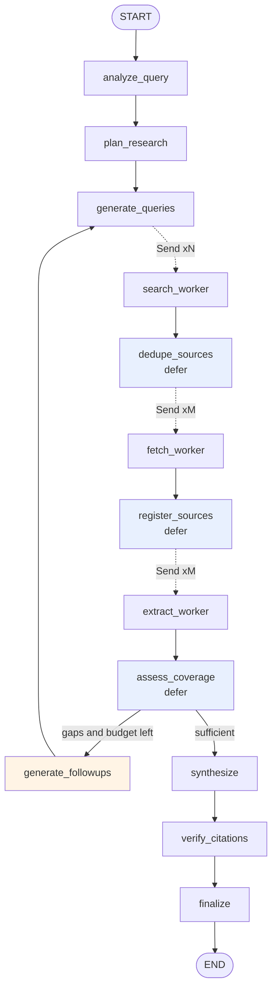

# Agentic Research Engine

A LangGraph research system that decomposes a question, searches the web in
parallel, extracts evidence as verbatim quotes checked against the source
text, and publishes only the claims its own verifier could support.

---

## The problem

Ask one model a broad research question and you get fluent prose with
confident, frequently fabricated citations. Three failures are bundled
together: no decomposition, no retrieval discipline, and no verification.
This project separates them and measures whether the result holds.

## What it does

- **Decomposes** the question into 4–6 researchable dimensions.
- **Searches in parallel**, one query per dimension, rewriting queries each
  round so follow-ups do not repeat earlier searches.
- **Deduplicates before fetching.** A page found by four sub-questions costs
  one fetch and one extraction call.
- **Extracts evidence as verbatim quotes**, each checked against the source.
  Only an exact match after whitespace and punctuation normalisation can
  ground a citation.
- **Reads PDFs with page provenance**, so a citation renders `[S4, p. 5]`.
- **Assesses its own coverage** and loops on specific gaps, under hard
  limits on rounds, queries, sources and model calls.
- **Verifies each claim against its own evidence**, then removes the claims
  that failed before publishing.

## Architecture



Blue nodes are fan-in barriers. The orange node is the only back-edge, and
it is budget-guarded. Design rationale, including rejected alternatives:
[`docs/ARCHITECTURE.md`](docs/ARCHITECTURE.md).

## Provenance

A claim references **evidence ids**, not source ids. The engine resolves
those to sources itself:

```python
Claim(
    text="Precision-recall is the better metric under heavy imbalance",
    evidence_ids=["S3-e1"],  # supplied by the model
    citation_ids=["S3"],  # derived by the engine
    kind=ClaimKind.FACTUAL,
)

EvidenceItem(
    id="S3-e1",
    source_id="S3",
    sub_question_id="SQ2",
    discovery=DiscoveryRef(query_id="Q5", sub_question_id="SQ2"),  # or None
    cross_attributed=False,
    quote="precision-recall curves are a more informative evaluation than ROC AUC",
    quote_match=QuoteMatch.EXACT_NORMALIZED,
    page=14,
)
```

That ordering is the point. Letting a model emit both invites the two to
disagree. An evidence id that does not resolve, or resolves to a quote that
never aligned to its source, is dropped and reported.

The chain has two halves with different guarantees:

- **Guaranteed.** Every citation resolves to an exact evidence item, its
  verbatim quote, its page where the source was a PDF, and its source.
- **Conditional.** The link back to a query exists only where that source
  was genuinely retrieved for that sub-question. Most evidence — 56% to 80%
  across the three recorded runs — is reused across sub-questions and is
  marked `cross_attributed` with no query id, rather than borrowing an
  unrelated one.

## Install

Python 3.11 or 3.12.

```bash
git clone https://github.com/NirmalKumar31/agentic-research-engine.git
cd agentic-research-engine
python -m venv .venv && source .venv/bin/activate
pip install -e .
cp .env.example .env
```

Web search needs a provider key in every mode.
[Tavily](https://app.tavily.com) has a sufficient free tier:

```bash
# .env
TAVILY_API_KEY=tvly-...
```

## Quickstart

```bash
agentic-research check                      # verify configuration
agentic-research research "your question"   # run
agentic-research show latest                # re-display a stored run
```

## Modes

| Mode | Models | Notes |
|---|---|---|
| `local` | Ollama (`qwen3:4b`) | No paid LLM usage. ~15 minutes per run on an M-series laptop. Still needs a search provider. |
| `cloud` | OpenAI | Substantially faster, at metered cost. No clean-corpus cloud run is currently published, so no timing is quoted here. |
| `hybrid` | Extraction local, reasoning cloud | Extraction is the highest-volume role and is mechanical. |

Set `LLM_MODE` and, for cloud or hybrid, `OPENAI_API_KEY`.
`ALLOW_CLOUD_FALLBACK` defaults to false: choosing local mode should not
quietly start spending money if Ollama is unreachable.

## Web interface

React and Vite in front of FastAPI, streaming the same graph events the CLI
consumes over SSE. The interface has two modes, chosen by the server.

**Replay** (`LIVE_RESEARCH_ENABLED=false`, the default) serves research runs
recorded earlier and committed inside the package. It needs no API key, no
search provider and no model.

**Live** (`LIVE_RESEARCH_ENABLED=true`) additionally accepts a visitor's own
question, under the demo ceilings.

Replay is the default for the public deployment because the daily run cap
lives in process memory, and a host that sleeps when idle resets it on every
cold start — so it cannot bound an account-level quota. Per-run request and
spend ceilings are unaffected. The alternative was a persistent quota store
whose only purpose would be letting strangers spend an API budget.

```bash
pip install -e ".[web]"
cd web && npm install && npm run build && cd ..
uvicorn agentic_research.web.api:get_asgi_app --factory
```

`render.yaml` deploys the replay site and declares no secrets.
`deploy/render-live.yaml` deploys the live variant and prompts for two keys.
Render's free tier sleeps when idle, so the first visit after a quiet period
takes about a minute; replay makes that cheap, because waking the service
spends nothing.

## Measured results

Three recorded local runs, `qwen3:4b`, one round, five sources each, no
cloud spend. Every substantive claim was checked against its own evidence —
`checked == checkable` — and claims the verifier could not support were
removed before publication.

| | RAG comparison | NIST framework | Fraud detection |
|---|---|---|---|
| Generated substantive claims | 19 | 16 | 22 |
| Supported | 19 | 13 | 19 |
| Partially supported | 0 | 2 | 3 |
| Unsupported | 0 | 1 | 0 |
| **Removed before publishing** | 0 | 3 | 4 |
| **Published** | 19 | 13 | 18 |
| Checked / checkable | 19/19 | 16/16 | 22/22 |
| Evidence integrity | 100% | 100% | 100% |
| Quote fidelity (exact) | 97% | 67% | 70% |
| Duration | 968s | 812s | 845s |

Removal is keyed on claim text plus cited evidence, so a claim that appears
in two places is removed from both. That is why the fraud run removes four
claims for three failing verdicts.

These are product artifacts, served by the demo. They are not a benchmark:
n=1 each, one model, one configuration.

### Attribution experiment

Three extraction strategies over one frozen six-source corpus, three
repeats each, `qwen3:4b`.

| | all-open | retrieved-only | adjacent |
|---|---|---|---|
| Evidence coverage | **100%** | 16.7% | 50.0% |
| Citable evidence | 27.3 | 17.7 | 18 |
| Cross-attributed | 79.6% | 0% | 59.1% |

Coverage was identical across all three repeats of every arm, so the
difference is structural rather than sampling noise. Production kept
all-open extraction. Scope and caveats:
[`examples/attribution-experiment/`](examples/attribution-experiment/).

An earlier local-versus-cloud comparison used a corpus whose source text had
been stripped and is excluded from current results.

## Security

Relevant because this fetches attacker-influenced URLs and feeds
attacker-influenced text to a model.

- **SSRF.** Deny-by-default on resolved addresses: loopback, private,
  link-local, multicast, reserved and unspecified ranges are blocked across
  IPv4 and IPv6 including IPv4-mapped forms. Every resolved address must be
  safe, not merely one of them.
- **DNS rebinding.** The connection goes to the address that was validated,
  with the hostname carried in the `Host` header and TLS SNI. A target with
  no validated address fails closed; failover never re-resolves; every
  redirect hop is revalidated and re-pinned. Certificate verification is
  preserved, and a wrong SNI is refused — tested against a real TLS server
  with a real certificate.
- **Spend.** Request, token and cost ceilings are reserved before each
  provider request, not counted after.
- **Prompt injection.** Retrieved text is framed as untrusted data, the
  extractor has no tools, and a claim invented from a page references no
  evidence so it fails resolution.
- **Secrets.** gitleaks runs over full history with rules for the providers
  used here, verified by a positive control that plants randomly generated
  credentials each run.

## Evaluation

```bash
agentic-research evaluate -n 3       # benchmark questions
agentic-research freeze "question"   # capture an evidence corpus
agentic-research compare -a local=ollama:qwen3:4b -a cloud=openai:gpt-6-luna
agentic-research attribution -r 3    # extraction strategy experiment
```

No gold answers. Every metric asks whether the system did what it claims,
not whether the world agrees.

| Metric | What it measures |
|---|---|
| `evidence_integrity` | Share of referenced evidence ids that exist and are citable |
| `citation_coverage` | Share of evidence-owing claims carrying a citation |
| `claim_support` | Share of checked claims fully entailed by their own evidence |
| `quote_fidelity` | Share of quotes found verbatim after normalisation |
| `evidence_coverage` | Share of sub-questions with ≥2 exact-match items from ≥2 sources |
| `source_diversity` | 1 − share held by the largest domain |

`citation_integrity` is a structural invariant, not a quality signal: the
engine derives citations from already-resolved evidence, so anything below
100% is an engine bug.

## Limitations

The short version: it verifies faithfulness to retrieved evidence, not truth
about the world. Exact quote matching proves textual alignment, not
entailment. Published figures come from single runs.

Full list: [`docs/LIMITATIONS.md`](docs/LIMITATIONS.md).

## Testing

```bash
pip install -e ".[dev]"
pytest              # hermetic: no network, no credentials, no cost
```

Every external boundary is faked, while the real state machine, reducers,
deduplication and verification execute. The TLS tests run a real local HTTPS
server with a certificate from an in-process CA, because certificate
verification cannot be asserted against a mock.

## Repository

```
src/agentic_research/
    config.py       typed settings, role→model resolution, budgets
    models.py       domain types (the provenance chain)
    graph/          state, reducers, workflow, routing, prompts, nodes
    llm/            role router, usage accounting, pricing
    search/         provider contract, Tavily, Brave
    retrieval/      URL safety, fetcher, PDF and content extraction
    evidence/       deduplication, quality, store, quote verification
    citations/      resolution, verification, publication gate
    evaluation/     metrics, benchmark, A/B, attribution experiment
    web/            FastAPI, recorded runs
web/                React + Vite frontend
tests/              unit (hermetic) · integration (opt-in)
examples/           attribution experiment, archived artifacts
docs/               ARCHITECTURE.md · LIMITATIONS.md
```

## Technology

LangGraph 1.2 · LangChain 1.6 · Pydantic 2 · FastAPI · React 19 + Vite ·
Tavily · trafilatura · pypdf · httpx · Typer · structlog · pytest, ruff,
mypy strict.

## License

MIT — see [LICENSE](LICENSE).
