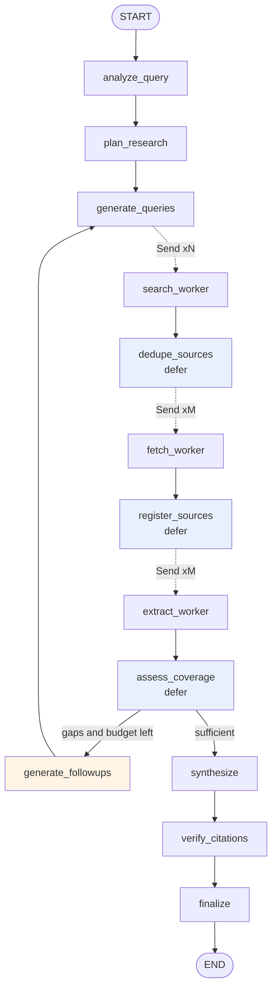

# Agentic Research Engine

A LangGraph research system that decomposes a question, searches the web in
parallel, extracts evidence as exact-normalized source quotes, and publishes
only the atomic claims a dedicated entailment classifier scored as supported
by one of their own cited quotes. Everything else is withheld.

Supported is not the same as relevant, so both are checked. A claim can be
entailed by its quote at 0.996, cited correctly, and answer nothing that was
asked — a deployed run published five of those before the answer contract
existed. Claims are held to a contract built from the question before
retrieval starts, and one that fills no part of it is withheld with its own
reason rather than reported as unsupported, which it is not.

---

## The problem

Ask one model a broad research question and you get fluent prose with
confident, frequently fabricated citations. Three failures are bundled
together: no decomposition, no retrieval discipline, and no verification.
This project separates them and measures whether the result holds.

## What it does

- **Builds an answer contract** from the question before retrieving
  anything — the canonical slots an answer of that kind must fill — and
  **refuses rather than guesses**: a comparison naming fewer than two
  entities produces an unusable contract with no slots at all.
- **Decomposes** the question into 4–6 researchable dimensions.
- **Searches in parallel**, one query per dimension, rewriting queries each
  round so follow-ups do not repeat earlier searches.
- **Deduplicates before fetching.** A page found by four sub-questions costs
  one fetch and one extraction call.
- **Extracts evidence as exact-normalized source quotes**, each checked
  against the retrieved text. Only a match after whitespace and
  punctuation normalisation can ground a citation.
- **Reads PDFs page by page**, so a citation renders `[S4, p. 5]` when
  page-aware PDF extraction succeeded.
- **Assesses its own coverage** and loops on specific gaps, under hard
  limits on rounds, queries, sources and model calls.
- **Writes atomic claims** — one verifiable proposition each, with the
  source's own modality, scope, quantities and time frame preserved.
- **Checks every claim against each of its own quotes separately**, using a
  pinned NLI classifier plus deterministic guards, and removes everything
  that does not clear the bar before publishing.
- **Checks relevance separately from support**, so a true, well-cited
  claim that answers nothing is withheld for that reason and labelled as
  such.
- **Repairs wording, never substance.** A claim refused on phrasing alone
  gets one rewrite, validated before it is re-verified.
- **Reports what it did not answer.** A report that publishes claims and
  fills none of the contract's core slots says so in its limitations.
- **Falls back to exact source excerpts** when nothing passes, rather than
  publishing an empty report or relaxing the bar.

## How a claim gets published

Two different models, doing two different jobs. The generative model never
decides whether its own claims are supported.

| Stage | Who | What |
|---|---|---|
| Planning, search, extraction, synthesis | `qwen3:4b` locally, or a cloud model | Decomposes the question, writes queries, pulls exact quotes, writes atomic claims |
| Deterministic guards | Plain Python | Refuse narrow, high-confidence overclaims: a figure not in the quote, a hedge promoted to a requirement, an invented ranking, causation from association, invented exclusivity |
| Semantic entailment | `DeBERTa-v3-large-mnli-fever-anli-ling-wanli`, pinned to revision `b3546ea6` | Scores each claim against each cited quote separately and returns probabilities only |
| Publication gate | Plain Python | Publishes only when one guard-passing quote entails the claim at ≥ 0.98 |

Claims must be **atomic** — one independently verifiable proposition
each. That is enforced before scoring, not merely requested of the
synthesiser, because a fused claim defeats every other guard: each of
them reasons about "the sentence that supports this claim", and a
compound claim hands them two.

A claim publishes when **a single cited quote carries it on its own**.
Quotes are never concatenated: assembling a broad claim out of several
partial ones is the failure this gate exists to prevent. Anything else is
withheld — below threshold, guard failure, unresolved evidence, a
non-citable quote, or a classifier that could not be reached. Every failure
path withholds, and none falls back to asking a generative model.

The threshold is calibrated, not guessed, and the model and revision are
pinned because a checkpoint that moves silently invalidates every number
here. All three are recorded on every judgment.

**What this does not mean.** The classifier is a learned model and can be
wrong. It is conservative by construction and by threshold, so its usual
error is withholding a true claim, but "withheld" and "published" are not
proofs. This is not zero hallucinations, not perfect factuality, not general
entailment correctness — it is a measured, fail-closed filter whose
behaviour on the cases tested is written down below.

## Does it answer the question?

A separate axis from support, and for one release only the first was
being asked. A deployed run published five claims that every gate above
passed — entailed by their own quotes, correctly cited, atomic — and
that collectively did not address what was asked. "Supported" had been
standing in for "an answer".

| Stage | Who | What |
|---|---|---|
| Answer contract | Plain Python | Turns the question into the slots an answer must fill. A comparison needs a direct contrast; a definition needs a definition. Refuses when the question cannot be given a shape. |
| Proposition decomposition | Plain Python | Splits a claim on a new subject with a finite verb, not on the word "and". Each assertion must earn its own entailment score. |
| Structural relevance | Plain Python | Does the claim fill the slot it declared, and mention what the question is about? Free, so it runs on everything. |
| Relevance judgement | The **critic** model, one batched call | Does this claim help answer the question? Asked of the critic, not the synthesiser — a model marking its own homework finds its work relevant. |
| Bounded repair | The critic, then every gate again | One rewrite for claims refused on wording alone. |
| Coverage | Plain Python | Which core slots the published report actually filled. |

**Support is checked per assertion, not per sentence.** A claim bundling
a measured figure with an assertion its quote never contained published
at 0.983, because the sentence as a whole was close enough to the quote
as a whole. Verifying the sentence verified the average of its parts,
and the unsupported half rode in on the supported one.

**Repair may not launder.** A rewrite is checked deterministically
before it is re-verified, and refused if it adds or changes a number,
introduces a named subject, invents causation, or states the claim more
strongly. Causal, exclusivity, framing and hedge failures are never
eligible at all: those are about what a claim says, not how, and
rephrasing them is laundering. Every attempt is recorded, including the
refused ones.

**Relevance fails closed.** If the judgement cannot be obtained, the
claims it would have covered are withheld. An unanswered relevance
question is not a yes.

## Architecture


```mermaid
graph TD
    START([START]) --> AQ[analyze_query] --> PR[plan_research] --> GQ[generate_queries]
    GQ -.Send xN.-> SW[search_worker] --> DS[dedupe_sources<br/>defer]
    DS -.Send xM.-> FW[fetch_worker] --> RS[register_sources<br/>defer]
    RS -.Send xM.-> EW[extract_worker] --> AC[assess_coverage<br/>defer]
    AC -->|gaps and budget left| GF[generate_followups] --> GQ
    AC -->|sufficient| SY[synthesize] --> VC[verify_citations] --> FIN[finalize] --> END([END])
    style DS fill:#e8f0fe
    style RS fill:#e8f0fe
    style AC fill:#e8f0fe
    style GF fill:#fff4e5
```

Blue nodes are fan-in barriers. The orange node is the only back-edge, and
it is budget-guarded. Design rationale, including rejected alternatives:
[`docs/ARCHITECTURE.md`](docs/ARCHITECTURE.md).

## Provenance

A claim references **evidence ids**, not source ids. The engine resolves
those to sources itself:

```python
Claim(
    text="Precision-recall is the better metric under heavy imbalance",
    evidence_ids=["S3-e1"],  # supplied by the model
    citation_ids=["S3"],  # derived by the engine
    kind=ClaimKind.FACTUAL,
)

EvidenceItem(
    id="S3-e1",
    source_id="S3",
    sub_question_id="SQ2",
    discovery=DiscoveryRef(query_id="Q5", sub_question_id="SQ2"),  # or None
    cross_attributed=False,
    quote="precision-recall curves are a more informative evaluation than ROC AUC",
    quote_match=QuoteMatch.EXACT_NORMALIZED,
    page=14,
)
```

That ordering is the point. Letting a model emit both invites the two to
disagree. An evidence id that does not resolve, or resolves to a quote that
never aligned to its source, is dropped and reported.

The chain has two halves with different guarantees:

- **Guaranteed.** Every citation resolves to an exact evidence item, its
  exact-normalized source quote, its source, and its page when page-aware
  PDF extraction succeeded for that source.
- **Conditional.** The link back to a query exists only where that source
  was genuinely retrieved for that sub-question. Much of the evidence —
  20.8% to 83.3% across the three recorded runs — is reused across
  sub-questions and is marked `cross_attributed` with no query id, rather
  than borrowing an unrelated one.

## Install

Python 3.11 or 3.12.

```bash
git clone https://github.com/NirmalKumar31/agentic-research-engine.git
cd agentic-research-engine
python -m venv .venv && source .venv/bin/activate
pip install -e .
cp .env.example .env
```

Web search needs a provider key in every mode.
[Tavily](https://app.tavily.com) has a sufficient free tier:

```bash
# .env
TAVILY_API_KEY=tvly-...
```

## Quickstart

```bash
agentic-research check                      # verify configuration
agentic-research research "your question"   # run
agentic-research show latest                # re-display a stored run
```

## Modes

| Mode | Models | Notes |
|---|---|---|
| `local` | Ollama (`qwen3:4b`) | No paid LLM usage. ~15 minutes per run on an M-series laptop. Still needs a search provider. |
| `cloud` | OpenAI | Substantially faster, at metered cost. No clean-corpus benchmark run is published, so no timing is quoted here. One bounded live validation run is recorded under [examples/live-validation/](examples/live-validation/). |
| `hybrid` | Extraction local, reasoning cloud | Extraction is the highest-volume role and is mechanical. |

Set `LLM_MODE` and, for cloud or hybrid, `OPENAI_API_KEY`.
`ALLOW_CLOUD_FALLBACK` defaults to false: choosing local mode should not
quietly start spending money if Ollama is unreachable.

## Web interface

React and Vite in front of FastAPI, streaming the same graph events the CLI
consumes over SSE. The interface has two modes, chosen by the server.

**Replay** (`LIVE_RESEARCH_ENABLED=false`, the default) serves research runs
recorded earlier and committed inside the package. It needs no API key, no
search provider and no model.

**Live** (`LIVE_RESEARCH_ENABLED=true`) additionally accepts a visitor's own
question, under the demo ceilings.

Replay is the default for the public deployment: it needs no credentials and
spends nothing, so it is the mode that can be left running.

The daily cap for live mode is held in an external atomic counter rather than
process memory, because a host that sleeps when idle would reset an in-memory
count on every cold start. That counter is shared across web instances and
survives a web restart. On Render's free Key Value plan it does **not** survive
a restart of the store itself — Render states that persistence is unavailable
on that plan — so the financial backstop there is the spend limit set on the
provider account, not this counter. Per-run request and spend ceilings are
separate and unaffected.

```bash
pip install -e ".[web]"
cd web && npm install && npm run build && cd ..
uvicorn agentic_research.web.api:get_asgi_app --factory
```

`render.yaml` deploys the replay site and declares no secrets.
`deploy/render-live.yaml` deploys the live variant. It prompts for three
credentials — OpenAI, Tavily, and a Hugging Face token for the private
verifier endpoint — and for three non-secret deployment values: the two
model IDs and the endpoint URL. It also provisions the Key Value store that
holds the daily cap, so that connection string is wired rather than pasted.
Render's free tier sleeps when idle, so the first visit after a quiet period
takes about a minute; replay makes that cheap, because waking the service
spends nothing.

## Usage

**Live demo:** <https://agentic-research-engine.onrender.com> — a free
instance, so the first request wakes it and takes about a minute.

The public demo replays recorded runs and needs no credentials. To run
live research yourself:

```bash
pip install -e ".[nli-local]"     # includes the local semantic verifier
cp .env.example .env              # add a search provider key
agentic-research check            # verifies the whole path before spending
agentic-research research "your question"
```

`check` exits non-zero if the selected path cannot complete a verified
run — a missing search key, an unreachable model, a model with no
verified price, or a verifier that cannot answer. Local mode runs the
models on Ollama with no paid LLM usage; live web research still needs a
search provider.

## Measured results

Three recorded local `qwen3:4b` runs, one round each, verified by the
pinned DeBERTa NLI classifier at threshold 0.98. Every substantive claim
was checked against each of its own quotes — `checked == checkable` in
all three — and only claims one quote carried on its own were published.

| | RAG comparison | NIST framework | Fraud detection |
|---|---|---|---|
| Unique sources | 5 | 5 | 5 |
| Evidence items | 10 | 26 | 30 |
| Generated substantive claims | 11 | 19 | 16 |
| Exact duplicates removed | 5 | 12 | 8 |
| Unique candidates checked | 6/6 | 7/7 | 8/8 |
| **Withheld** | 4 | 4 | 2 |
| **Published** | **2** | **3** | **6** |
| Quote fidelity (exact) | 70% | 92% | 90% |
| Page-cited evidence | 0 | 6 | 0 |
| Duration | 1478s | 1453s | 1067s |

21 unique candidates across the three runs, all checked, **11 published
and 10 withheld**.

### Release validation

Publishing something is easy; publishing only what the evidence supports
is the claim being made. So every candidate — not only the published
ones — was reviewed against the exact quote the gate selected, **with the
automated verdict, score, guard results and publication decision
hidden**, and the labels joined back by case id afterwards. The packet,
the labels and the join are in
[`examples/release-audit/`](examples/release-audit/).

| | published | withheld |
|---|---|---|
| **reviewer: supported** | 11 | 8 |
| **reviewer: unsupported or uncertain** | **0** | 2 |

Precision 1.00, recall 0.58. **Zero unsupported published claims, zero
uncertain ones.**

Of the 10 withheld: 5 scored below the entailment threshold and 5 were
refused by a deterministic guard before the score mattered (3 atomicity,
1 hedge, 1 numeric). One of those — a claim dropping the source's
*"often"* — is the frequency-deletion rule catching a real overclaim on
live data.

This is a **blinded self-review, not an independent benchmark**: the
reviewer built the system. A packet for a genuinely independent second
reviewer is committed at
[`examples/release-audit/reviewer-packet.json`](examples/release-audit/reviewer-packet.json),
carrying only claims, quotes and sources — no verdict, score, guard
result or prior label.

### Hosted acceptance

Deployment acceptance, not a research-quality evaluation: one live run
through the deployed endpoint under the public budgets, captured byte
for byte. Everything in
[`examples/live-validation/v12-20260929-001737/`](examples/live-validation/v12-20260929-001737/)
is derived from those bytes offline, and rebuilding it is a command —
a file that no longer matches `checksums.sha256` was edited, not
derived.

*"How does a large language model differ from a neural network?"* —
chosen because the previous release answered it badly.

| | |
|---|---|
| Generated / checked / **published** | 7 / 7 / **3** |
| Withheld: below threshold | 1 |
| Withheld: guard failure (atomicity) | 1 |
| Withheld: **supported but irrelevant** | **2** |
| Duration | 165.4s of a 240s ceiling |
| Cost | $0.009466 OpenAI, 6 Tavily credits |

The two withheld for irrelevance are the point. Both were entailed by
their own quotes — at **0.996** and **0.990** — and correctly cited:

> *"Neural networks consist of layers of nodes, with each node
> representing a mathematical function."*
> → withheld: *defines neural networks but does not distinguish them
> from LLMs or explain their relationship.*

True, sourced, and not an answer. Under the previous release it would
have published.

The engine then disagreed with its own output. It published three
claims and wrote in its limitations that *"this research did not answer
the question. Nothing published states how large language model (LLM)
and neural network differ; what survived describes them separately."*

**Two findings, both recorded rather than smoothed over**, in
[`manual-review.md`](examples/live-validation/v12-20260929-001737/manual-review.md):

1. A rewrite was refused with *"cannot fill the contrast slot"* and the
   identical sentence published — correct, because the two claims
   declared different slots, and unreadable, because the slot was not
   serialised. Fixed for future runs; **the artifact for this run
   cannot be repaired**, because the field was never sent and the
   deployment admits one run a day.
2. For *"how does X differ from Y"* where Y is a superset of X, the
   honest answer is a subset relationship — which the engine found,
   published, and then reported as not answering, because the
   contract's core slot for a comparison was a direct contrast.
   **Fixed:** a comparison is now answered by a contrast *or* a
   relationship. Verified by replaying this run's own contract and
   published slots through the new coverage — the change post-dates
   the capture, and the deployment admits one run a day, so it is
   not covered by a second live run.

**Proposition decomposition was not exercised by this run.** No claim
decomposed into more than one part, so that path is covered by tests
and unproven in production. One run is not a benchmark either: three
published claims here says nothing about the next question.

### How the audits went

Six manually reviewed canonical audits. The first three each published
exactly one claim that survived every automated check and failed a human
read, and each produced a general rule rather than a patch:

| Audit | What escaped | Fix |
|---|---|---|
| 1 | `"might lack"` published as `"lack"` | hedge-deletion guard |
| 2 | `"We demonstrate that X"` published as `"X"` | research-voice guard |
| 3 | `"our dataset"` → `"datasets"`, inside a two-sentence claim | proposition-level atomicity |
| 4 | — | clean |
| 5 | — | clean, blinded |
| 6 | — | clean, blinded, and the first run with atomicity actually wired |

Audit 6 exists because an independent code review found that audits 4
and 5 were produced with the clause-level atomicity check **written and
tested but never called** — the guard still counted sentences. The
property had been reported as enforced and was not. Every guard now has
an integration test that drives the real publication path with a scorer
entailing everything, so a disconnected guard fails a test rather than a
review.

These are product artifacts, served by the demo. Live search is
nondeterministic, so re-running these questions does not recover these
sources — see [LIMITATIONS](docs/LIMITATIONS.md).

### Attribution experiment

Three extraction strategies over one frozen six-source corpus, three
repeats each, `qwen3:4b`.

| | all-open | retrieved-only | adjacent |
|---|---|---|---|
| Evidence coverage | **100%** | 16.7% | 50.0% |
| Citable evidence | 27.3 | 17.7 | 18 |
| Cross-attributed | 79.6% | 0% | 59.1% |

No variation was observed across the three repeats of any arm. Three
draws cannot establish that sampling noise is absent; the defensible
point is structural. On this corpus each source was retrieved for a mean
of 1.17 sub-questions, so retrieved-only extraction mechanically limits
how many sub-questions can reach a two-source coverage bar. Production
uses all-open because this project prioritises multi-source coverage
over complete query-level lineage. Scope and caveats:
[`examples/attribution-experiment/`](examples/attribution-experiment/).

An earlier local-versus-cloud comparison used a corpus whose source text had
been stripped and is excluded from current results.

## Security

Relevant because this fetches attacker-influenced URLs and feeds
attacker-influenced text to a model.

- **SSRF.** Deny-by-default on resolved addresses: loopback, private,
  link-local, multicast, reserved and unspecified ranges are blocked across
  IPv4 and IPv6 including IPv4-mapped forms. Every resolved address must be
  safe, not merely one of them.
- **DNS rebinding.** The connection goes to the address that was validated,
  with the hostname carried in the `Host` header and TLS SNI. A target with
  no validated address fails closed; failover never re-resolves; every
  redirect hop is revalidated and re-pinned. Certificate verification is
  preserved, and a wrong SNI is refused — tested against a real TLS server
  with a real certificate.
- **Spend.** Ceilings are reserved before each provider request rather
  than counted after it. The provider-request and output-token ceilings
  are exact. The input-token and cost ceilings are *estimated* before
  dispatch — input size is approximated and prices come from a local
  table — so they bound the expected cost, not the invoice. For a public
  deployment the provider account's own spend limit is the durable
  backstop, and the deployment docs say so.
- **Prompt injection.** Retrieved text is framed as untrusted data, the
  extractor has no tools, and a claim invented from a page references no
  evidence so it fails resolution.
- **Secrets.** gitleaks runs over full history with rules for the providers
  used here, verified by a positive control that plants randomly generated
  credentials each run.

## Evaluation

```bash
agentic-research evaluate -n 3       # benchmark questions
agentic-research freeze "question"   # capture an evidence corpus
agentic-research compare -a local=ollama:qwen3:4b -a cloud=openai:gpt-6-luna
agentic-research attribution -r 3    # extraction strategy experiment
```

No gold answers. Every metric asks whether the system did what it claims,
not whether the world agrees.

| Metric | What it measures |
|---|---|
| `evidence_integrity` | Share of referenced evidence ids that exist and are citable |
| `citation_coverage` | Share of evidence-owing claims carrying a citation |
| `claim_support` | Share of checked claims fully entailed by their own evidence |
| `quote_fidelity` | Share of quotes found verbatim after normalisation |
| `evidence_coverage` | Share of sub-questions with ≥2 exact-match items from ≥2 sources |
| `source_diversity` | 1 − share held by the largest domain |

`citation_integrity` is a structural invariant, not a quality signal: the
engine derives citations from already-resolved evidence, so anything below
100% is an engine bug.

## Limitations

The short version: it verifies faithfulness to retrieved evidence, not truth
about the world. Exact quote matching proves textual alignment, not
entailment. Published figures come from single runs.

Full list: [`docs/LIMITATIONS.md`](docs/LIMITATIONS.md).

## Testing

```bash
pip install -e ".[dev]"
pytest              # hermetic: no network, no credentials, no cost
```

Every external boundary is faked, while the real state machine, reducers,
deduplication and verification execute. The TLS tests run a real local HTTPS
server with a certificate from an in-process CA, because certificate
verification cannot be asserted against a mock.

## Repository

```
src/agentic_research/
    config.py       typed settings, role→model resolution, budgets
    models.py       domain types (the provenance chain)
    graph/          state, reducers, workflow, routing, prompts, nodes
    llm/            role router, usage accounting, pricing
    search/         provider contract, Tavily, Brave
    retrieval/      URL safety, fetcher, PDF and content extraction
    evidence/       deduplication, quality, store, quote verification
    citations/      resolution, verification, publication gate
    evaluation/     metrics, benchmark, A/B, attribution experiment
    cli/            Typer commands, terminal progress rendering
    web/            FastAPI, recorded runs
web/                React + Vite frontend
tests/              unit (hermetic) · integration (opt-in)
examples/           attribution experiment, archived artifacts
docs/               ARCHITECTURE.md · LIMITATIONS.md
```

## Technology

LangGraph 1.2 · LangChain 1.6 · Pydantic 2 · FastAPI · React 19 + Vite ·
Tavily · trafilatura · pypdf · httpx · Typer · structlog · pytest, ruff,
mypy strict.

## License

MIT — see [LICENSE](LICENSE).
