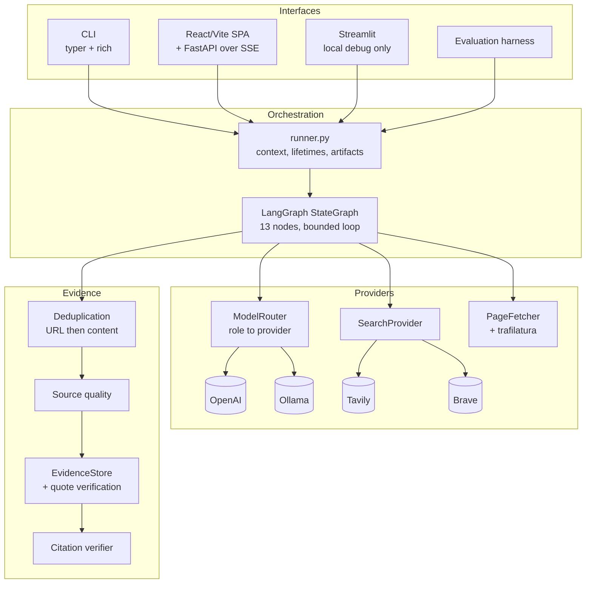
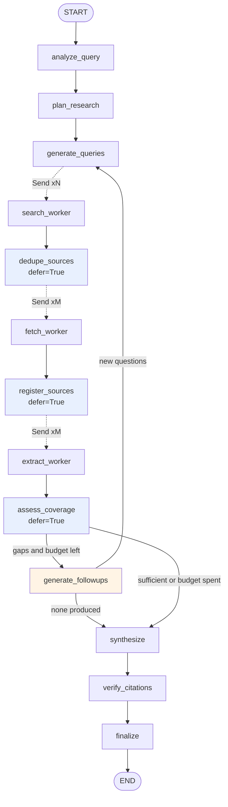
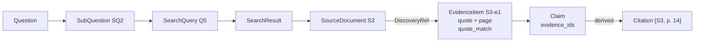
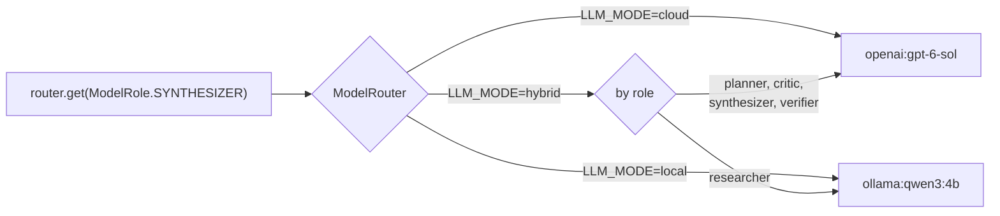

# Architecture

This document explains how the engine works and, more importantly, *why* each
piece is shaped the way it is. Where a decision had a real alternative, the
alternative and the reason for rejecting it are stated.

---

## 1. The problem

Asking one model "compare approaches for detecting fraud in imbalanced
datasets" produces fluent, confident prose with plausible-looking citations
that frequently point at nothing. Three separate failures are bundled
together:

1. **No decomposition.** A broad question has several dimensions. One pass
   answers the easiest one and asserts the rest.
2. **No retrieval discipline.** Either nothing is retrieved, or a snippet is
   treated as sufficient evidence for a claim it does not contain.
3. **No verification.** Nothing checks that a cited source exists, was read,
   or says what the citation implies.

The engine addresses each one with a distinct mechanism: a planner, an
evidence pipeline with stored provenance, and a citation verifier.

---

## 2. System overview



Interfaces never touch providers. They drive `runner.stream_research`, which
builds the runtime context and runs the graph. This is why the CLI, the web
API, the Streamlit app and the evaluation harness contain no research logic
at all.

The React/FastAPI app is the portfolio interface and the one that matters.
Streamlit came first and is kept as a local debugging surface; it is not
what gets deployed.

### 2.1 Two deployment modes

The same FastAPI application serves both, and the difference is one
server-side setting.

| | Replay (public default) | Live |
|---|---|---|
| `LIVE_RESEARCH_ENABLED` | `false` | `true` |
| `/api/research` | 403 before any work | runs, under demo ceilings |
| Credentials needed | none | OpenAI + Tavily |
| What the UI offers | recorded runs | recorded runs plus a composer |
| `/api/config` reports | `service_mode: replay` | `service_mode: live` |

Replay serves recorded runs from JSON committed inside the package, so the
public site needs no provider, no key and no network egress. That is not a
presentation choice. The demo's daily run cap lives in process memory, and
a free host that spins down when idle resets it on every cold start — so it
cannot bound an account-level quota. Per-run request and spend ceilings are
unaffected and still enforced before dispatch; the *daily* one does not
survive a restart.

The alternative was a persistent atomic quota store whose only purpose
would be letting anonymous visitors spend the API budget. For a portfolio
demo that is architecture bought for nothing.

The gate is enforced in the route, before query validation and before
anything constructs a run, because disabling a button in React leaves the
endpoint open to `curl` and that endpoint spends money.

---

## 3. The graph



Blue nodes are barriers. The orange node is the only back-edge.

### 3.1 Why stage-level fan-out

The obvious design gives each "researcher" a sub-question and has it search,
fetch and extract. It is easier to draw and it is worse, for one reason: **a
worker cannot see its siblings.**

Three sub-questions about fraud detection will all surface the same Wikipedia
page. Under worker-level fan-out that page is downloaded three times and sent
to a model three times. The workers cannot deduplicate because none of them
knows the others found it.

Splitting the pipeline at stage boundaries puts a deduplication barrier
between search and fetch, where every result from every query is visible at
once:

```
9 raw results  ->  dedupe  ->  3 unique URLs  ->  3 fetches, 3 extraction calls
```

The cost is two extra synchronisation points, which add latency equal to the
slowest worker in each stage. The benefit is that redundant work is eliminated
rather than merely counted.

How much this saves depends entirely on how much the sub-questions overlap,
and it is worth being precise about that rather than quoting a flattering
number:

- A unit test pins the *mechanism*: three queries returning the same three
  URLs produce exactly three fetches, not nine.
- On the live run recorded in the README, overlap was low — 48 real Tavily
  results contained only 2 duplicate URLs (4%), because six genuinely
  different sub-questions return genuinely different pages.

So the barrier is cheap insurance rather than a large constant saving. It
matters most where sub-questions are closely related, which is exactly the
case where a per-researcher design would waste the most.

### 3.2 Fan-in with `defer`

```python
graph.add_node("dedupe_sources", dedupe_sources, defer=True)
```

`defer=True` tells LangGraph to schedule the node only once every task writing
to it has settled. The alternative is to track completions in state and
re-check on each pass, which is a hand-written barrier with the usual race
between the last worker's write and the checker's read.

### 3.3 Two behaviours found by testing

Neither appears in the documentation examples. Both were verified against
LangGraph 1.2.x with standalone scripts before the design depended on them.

**`error_handler` does not fire for `Send`-dispatched nodes.**

```python
graph.add_node("worker", worker, error_handler=handler)   # plain node: works
# same registration, dispatched via Send: handler never runs, super-step dies
```

An exception escaping one parallel worker therefore destroys its siblings'
completed work. Every worker in this engine catches its own exceptions and
writes a `RunError` into state. This is not defensive padding — a real
`httpx.ReadTimeout` from Ollama took out an entire extraction round during
development, because the worker caught only `LLMError` and the router had
mapped connection errors but not timeouts.

**`draw_mermaid()` mis-renders this graph.**

A third, less dangerous one, found while generating the diagrams.
``compiled.get_graph().draw_mermaid()`` drops ``finalize -> END`` and invents
three conditional edges that were never declared, including
``finalize -> register_sources``. Bisecting showed it appears once the
``dedupe_sources`` branch is added, and it reproduces with placeholder nodes.
Execution is unaffected — ``builder.edges`` and ``builder.branches`` are
correct, and a test asserts ``finalize`` runs exactly once — but a published
diagram showing a loop that does not exist is worse than none. The
``graph`` CLI command therefore renders Mermaid from the builder's own
structures, and a test pins that rendering against them.

**A conditional edge returning `[]` silently ends the graph.**

```python
def dispatch(state):
    return [Send("worker", x) for x in items]   # items empty -> graph just stops
```

No error is raised; the downstream node never runs. Every dispatcher here
returns an explicit fallback node name when it has nothing to send:

```python
def dispatch_searches(state):
    queries = state.get("pending_queries", [])
    if not queries:
        return "assess_coverage"      # fall through rather than vanish
    return [Send("search_worker", {"query": q}) for q in queries]
```

---

## 4. State

### 4.1 TypedDict, not a Pydantic model

LangGraph merges *partial* updates. A node returns only the keys it touched,
and each key is folded into the existing value by that channel's reducer. A
`TypedDict` expresses this naturally; a Pydantic state model fights it, since
every update looks like a full-object replacement.

The values inside are Pydantic models, so validation still applies where it
matters. Framework-shaped container, validated contents.

### 4.2 Reducers

```python
class ResearchState(TypedDict, total=False):
    sources: Annotated[list[SourceDocument], merge_sources]
    evidence: Annotated[list[EvidenceItem], operator.add]
    counters: Annotated[dict[str, int], sum_counters]
    pending_queries: list[SearchQuery]          # single writer, plain replace
```

A channel needs a reducer exactly when more than one node — or more than one
parallel copy of one node — writes to it.

`merge_sources` is custom because a source is written twice: as a stub when
its URL is deduplicated (which is where its `S<n>` id is assigned), then again
with its text by whichever fetch worker handled it. Plain concatenation would
leave two copies of every source and break citation lookup. Merging by id with
last-write-wins is also what makes a node retry idempotent.

### 4.3 Clearing an accumulating channel

`round_results` accumulates across parallel search workers, and must be empty
at the start of the next round. With an `operator.add` reducer there is no way
to return "empty" — `[]` is the additive identity. LangGraph 1.x provides an
explicit escape hatch:

```python
return {"round_results": Overwrite(value=[])}
```

### 4.4 State versus context

```python
@dataclass
class RunContext:
    settings: Settings
    router: ModelRouter
    search: SearchService     # holds an open httpx.AsyncClient
    fetcher: PageFetcher      # holds semaphores
    budget: RunBudget
```

State is checkpointed and must survive JSON. Context holds live objects that
cannot be and must not be. LangGraph 1.x has a typed runtime context reached
with `get_runtime(RunContext)`.

Placing the semaphores here also fixes a subtler problem. A module-level
`asyncio.Semaphore` binds to whichever event loop first awaits it and then
leaks its limit across runs — which shows up as tests that pass alone and fail
together.

---

## 5. Provenance

### 5.1 Evidence-first claims

The first version of this system stored citations as source ids on each
claim. That looked like provenance and was not: nothing recorded *which
evidence* produced a sentence. When verification later needed to check
whether a source supported a claim, it had no way to know which span was
responsible, so it sampled the first three evidence items belonging to the
cited source and judged against those. Frequently that meant grading a
claim against text that played no part in writing it.

The fix is to make evidence the primary link and derive everything else:

```python
class Claim(BaseModel):
    text: str
    evidence_ids: list[str]   # the model supplies only this
    citation_ids: list[str]   # the ENGINE derives this
    kind: ClaimKind
```

The synthesiser is shown evidence ids (`S3-e2`) and never source ids, and
references the items it actually used. The engine then resolves each id to
its source. Letting a model emit both invites the two to disagree, and
there would be no way to tell which was right.



Read right to left, every arrow is stored rather than inferred.

**A consequence worth stating plainly:** `citation_integrity` — the metric
previously published as "citation validity" and reported at 100% — is now
true by construction, because citations only exist for evidence that
already resolved. It is an engine invariant, not a quality signal. The
measurement that actually says something about the model is
`evidence_integrity`: how often the model referenced evidence that exists
and is citable. On an adversarial fixture that reads 0.25 where the old
metric read 1.0. The honest metric is the lower one.

### 5.2 Discovery provenance

A source used to hold two independent lists, `found_by_queries` and
`answers_sub_questions`, which lost the relationship between them. Given a
page found by Q2 (serving SQ1) and Q7 (serving SQ4), nothing recorded which
query belonged to which sub-question — so evidence took
`found_by_queries[0]`, correct only by luck.

They are now `DiscoveryRef(query_id, sub_question_id)` pairs. An evidence
item records the path matching *its own* sub-question:

```python
discovery = source.discovery_for(sub_question_id)   # None if no such path
cross_attributed = discovery is None
```

When a finding addresses a sub-question that no query for it retrieved,
that is recorded as `cross_attributed=True` with no query id, rather than
borrowing an unrelated one. The chain stops honestly instead of appearing
complete.

### 5.3 Ids are assigned by the engine

Source ids are allocated in the deduplication barrier — a single-writer
node — never by workers and never by a model. Parallel workers allocating
from a shared counter would collide, and a model permitted to mint source
ids will eventually cite `[S7]` in a run that retrieved four sources.

Evidence ids are `f"{source_id}-e{n}"`, unique without coordination because
exactly one worker owns a given source.

### 5.4 Quote matching is three-valued

The original check returned a boolean and accepted a 0.88 similarity match,
and the result was published as "verbatim". It was not.

| Class | Meaning | Citable |
|---|---|---|
| `EXACT_NORMALIZED` | Present after normalising whitespace and smart punctuation | Yes |
| `FUZZY` | Close but reworded | **No** |
| `NONE` | Not locatable | No |

Words may not differ. `"positive cases"` → `"positive examples"` is FUZZY,
kept for diagnostics, and can never ground a citation.

The matcher also returns the character offset of the match, which is how a
PDF quote recovers its page number.

### 5.5 Uncitable evidence cannot reach synthesis

Confidence weighting alone was not enough: an unverified item at 0.7
relevance scored 0.28 against a 0.25 floor and could ground a citation. So
a claim could rest entirely on text nobody could find in the page.

`build_package(citable_only=True)` is now the default, and resolution
rejects any claim referencing uncitable evidence. Diagnostic callers can
still see everything that was extracted.

## 6. The research loop

```python
def route_after_coverage(state) -> str:
    if coverage.sufficient:                                    return "synthesize"
    if round_number >= budget.max_research_rounds:             return "synthesize"
    if len(completed_queries) >= budget.max_search_queries:    return "synthesize"
    if len(sources) >= budget.max_sources:                     return "synthesize"
    if not coverage.recommended_followups and not missing:     return "synthesize"
    return "generate_followups"
```

Four of the five conditions are independent of the critic's opinion. A model
rigged to always demand more research still stops at the round cap — there is
a test that does exactly that.

### 6.1 Coverage is counted, then judged

Splitting this was deliberate.

**Counted mechanically:** verified evidence items per sub-question, distinct
sources per sub-question, contradictions present, domain concentration.

```
covered = at least 2 verified items from at least 2 distinct sources
coverage_ratio = covered sub-questions / total sub-questions
```

**Judged by a model:** whether evidence is on target, which angle nobody
examined, what the disagreements are about.

Asking a model to output "coverage: 0.72" yields a number with no definition
that nonetheless looks authoritative in a metrics table. The ratio above has a
definition you can state in one sentence, and the routing logic and the
`evidence_coverage` evaluation metric use the same function — so the measure
and the behaviour cannot drift apart.

The sufficiency threshold is 0.7, not 1.0: insisting on full coverage would
burn rounds chasing the one dimension the web has little to say about, when
the report can simply state that gap.

---

## 7. Model routing



Application code asks for a **role**, never a provider. Five roles: planner,
researcher, critic, synthesizer, verifier.

### 7.1 The hybrid split rule

A role goes local when its output is short, schema-constrained, and produced
many times per run. It stays in the cloud when a wrong answer changes the
final report.

Evidence extraction is the clearest local candidate: it runs once per source
(the highest-volume role by far) and its job is quotation, not judgement.
Synthesis is the clearest cloud candidate: it runs once and it is what the
user reads.

### 7.2 One choke point

Every model call goes through `RoleModel.structured`, which is the only place
that reserves budget, records tokens and latency, repairs malformed output,
and maps transport errors to domain errors. Adding a node cannot create an
unmetered call, because there is no other way to call a model.

### 7.3 Structured output and repair

```python
runnable = model.with_structured_output(schema, method="json_schema", include_raw=True)
```

`include_raw=True` is the important part. Without it a schema violation raises
and the attempt is lost. With it, the failure comes back as data:

- token usage from the failed attempt is still on the raw message, so a failed
  call is still counted and still billed;
- the validation error can be fed back to the model for one repair attempt.

### 7.4 Fallback is off by default

If a local model is missing, the run stops with the exact `ollama pull`
command. It does **not** silently switch to a paid provider. Someone who chose
`LLM_MODE=local` may have chosen it for cost or privacy reasons, and a
fallback that quietly overrides that is a bad surprise either way.
`ALLOW_CLOUD_FALLBACK=true` opts in.

---

## 8. What running on a 4B local model actually taught us

Measured on `qwen3:4b`, same question, same sources.

**Structured output works; prose instructions do not.** The synthesis prompt
asked for citation markers like `[S3]` in claim text. The model produced a
complete, well-organised report containing **zero** markers. Moving citations
from a prose convention to a required `source_ids` schema field fixed it
immediately:

| | prose markers | schema field |
|---|---|---|
| Citations emitted | 0 | 9 |
| Citation validity | n/a | 100% |

The general rule, and the reason it is worth writing down: **if a model must
produce something reliably, put it in the schema, not the instructions.**

**Quotation is reliable; judgement is not.** Extracting verbatim quotes, the
model is accurate: 83% quote fidelity on one run and 30/30 (100%) on the live
run recorded in the README. Judging whether evidence entails a claim, it is
much weaker: 33% and 60% support rates on those same two runs, grading its own
report. Copying text is easy for a small model; deciding whether one sentence
establishes another is not. This is the empirical basis for putting extraction
local and verification in the cloud in hybrid mode, rather than an assumption
about parameter count.

**Local models do not parallelise.** Ollama serves one model largely
serially. Fanning eight extraction calls at it produced queueing and read
timeouts, not throughput. Hence `MAX_PARALLEL_LOCAL_LLM_CALLS`, defaulting to
2, applied only to local providers. Cloud providers handle concurrency
server-side and are gated by the stage semaphores instead.

---

## 9. Concurrency

Three independent limits, because they protect three different things:

| Limit | Protects | Default |
|---|---|---|
| `MAX_PARALLEL_SEARCHES` | the search provider's rate limit | 5 |
| `MAX_PARALLEL_FETCHES` | our own network and memory | 8 |
| per-host limit (2, in code) | individual origin servers | 2 |
| `MAX_PARALLEL_LOCAL_LLM_CALLS` | a serially-served local model | 2 |

The per-host limit exists because a research round routinely returns six
results from one documentation site, and six simultaneous connections to one
origin is both rude and a good way to get rate-limited mid-run.

Retries use exponential backoff **with jitter**. Jitter is not decoration: a
round fans out several queries at once, so without it they retry in lockstep
and re-trigger the same rate limit.

---

## 10. Persistence

SQLite via `AsyncSqliteSaver`, and nothing heavier.

A research run is a single-process job lasting minutes whose state is a few
hundred kilobytes. Postgres would add an operational dependency to make the
architecture *sound* larger. `CHECKPOINT_BACKEND=memory` is used by tests, and
`none` disables checkpointing for throwaway runs.

Checkpointing earns its place for a real reason: a run that dies in synthesis
has already paid for all the searching, fetching and extraction. With the
checkpoint, that work survives.

Separately, every run writes inspectable artifacts:

```
outputs/<run_id>/
    report.md        rendered report
    sources.json     every source, quality score and fetch status
    evidence.json    every evidence item, quote and verification flag
    metrics.json     the full metric set
    run.json         plan, queries, coverage history, errors
```

---

## 11. Error handling

The principle: **a failure that affects one item degrades the run; it does not
end it.**

| Failure | Response |
|---|---|
| One search query fails | Retry with backoff, then record and continue |
| Auth / out of credits | Fail that query immediately — retrying cannot help |
| Page 404s, times out, is a PDF | Classify, mark the source unusable, continue |
| Page is JavaScript-only | `EMPTY` status; not counted as evidence |
| Extraction call fails | Record, continue with the other sources |
| Structured output malformed | One repair attempt with the validation error |
| Planning fails | Fall back to the question as a single dimension |
| **Synthesis fails** | Emit the verified evidence as a list |
| Local model missing | Stop with the `ollama pull` command, or fall back if allowed |
| Budget exhausted | Stop research, still produce a report, state the limitation |

The synthesis fallback matters more than it looks. A run that gathered forty
verified findings should not return nothing because the last call failed — the
evidence is the expensive part.

---

## 12. Evaluation

No gold answers. They are expensive, go stale quickly, and mostly measure
whether the model agrees with whoever wrote them.

Every metric instead asks whether the system did what it claims. Several
were renamed during the provenance rework because their original names
asserted more than the measurement supported.

| Metric | Definition | What it does **not** say |
|---|---|---|
| `evidence_integrity` | Evidence ids referenced that exist and are citable | Nothing about whether the evidence supports the claim |
| `citation_integrity` | Citation markers resolving to a retrieved source | Nothing about support. Now an engine invariant |
| `citation_coverage` | Evidence-owing claims carrying a citation | Nothing about citation *correctness* |
| `claim_support` | Checked claims fully entailed by their own evidence | Sampled unless marked exhaustive |
| `partial_support` | Checked claims only partially entailed | — |
| `quote_fidelity` | Quotes found verbatim (exact-normalised) | Nothing about whether the page is right |
| `quote_drift` | Quotes matching only approximately | — |
| `evidence_coverage` | Sub-questions with ≥2 verified items from ≥2 sources | Nothing about depth or quality |
| `source_diversity` | 1 − share held by the largest domain | Diversity is not independence |
| `contradiction_auditability` | Disagreements evidenced on both sides | — |
| `duplicate_avoidance` | Results deduplicated before fetching | — |
| `unused_source_rate` | Retrieved sources never cited | — |

### 12.1 Renaming, and why the honest number is lower

`citation_validity` implied a source supported its claim. It only ever
measured that an id resolved. Worse, under the evidence-first design it
became trivially 1.0, because the engine derives citations only from
evidence that already resolved — so publishing it as a headline would be
reporting an invariant as an achievement.

`evidence_integrity` replaces it as the model-facing measure, and it is
lower, because it counts the references a model got wrong.

The same applies to quote fidelity: tightening "verbatim" to exact-only
moves reworded matches out of the numerator, so the honest figure is below
the old one. Both were published downward rather than quietly redefined.

### 12.2 Sampled versus exhaustive

Entailment costs one model call per claim. Interactive runs cap at ten and
the metric is renamed `sampled_claim_support`; benchmark runs check every
eligible claim and set `entailment_exhaustive`. A sampled figure published
under an exhaustive name is exactly the kind of number this project exists
not to produce.

### 12.3 Controlled comparison

Running the graph twice with two models does not compare the models: search
results move, so the reports rest on different evidence. `freeze` captures
one run's retrieval output and `compare` replays only synthesis and
verification against it, so both arms see byte-identical input. The replay
path raises if anything tries to search, so a regression fails loudly
rather than silently invalidating every future comparison.

### 12.4 What none of it measures

Whether the report is **true**. All of this measures faithfulness to
retrieved sources. A confident report built entirely on wrong pages scores
perfectly. That is a ceiling on what the system can claim, not a gap to
close with another metric.

## 13. Security

### 13.1 SSRF

The fetcher follows URLs chosen by a search provider and then whatever
those pages redirect to. With `follow_redirects=True` and no address
filtering — the original state — a hosted deployment fetches
`http://169.254.169.254/` on request and hands instance credentials to a
language model.

The policy is deny-by-default on *addresses*, not hostnames, because a
hostname can resolve anywhere:

- http/https only; non-web ports refused
- loopback, private, link-local, multicast, reserved, unspecified — v4 and v6
- IPv4-mapped and 6to4 IPv6 unwrapped and rechecked
- cloud metadata named explicitly as well as covered by range
- `localhost`, `.local`, `.internal` refused syntactically, so the check
  does not depend on the resolver behaving
- **every** resolved address must be safe, not merely one: a name with one
  public and one private A record would otherwise pass depending on which
  the client picked

Redirects are followed manually, revalidating each hop. DNS failure is
reported as a network error rather than a policy block, so the blocked
count stays a meaningful signal rather than being diluted by typos.

**DNS rebinding — closed by pinning.** Validating a *name* and then
connecting by *name* leaves a window: the attacker answers the validation
lookup with a public address and the connection lookup with a private one.
The connection is therefore made to the address that was actually
validated:

```python
target = validate_url(current)            # resolves and checks every address
url, headers, ext = target.pinned_request()
# url     -> https://93.184.216.34/path      (the checked address)
# headers -> {"Host": "example.com"}         (virtual hosting still works)
# ext     -> {"sni_hostname": "example.com"} (certificate still verified)
```

Three properties make this safe rather than merely different:

* **Certificate verification is preserved, not bypassed.** TLS still
  presents and validates the original hostname via SNI. Pinning that
  silently disabled hostname checking would be worse than the hole it
  closes, so the test suite asserts both directions — correct SNI
  connects, wrong SNI is refused — against a real local TLS server with a
  real certificate. `verify=False` appears nowhere.
* **Fail closed.** A target with no validated address raises
  `UnpinnedTargetError` rather than falling back to hostname connection,
  which would quietly restore the window.
* **Failover never re-resolves.** If the first address is unreachable the
  fetcher tries the others *from the same validated resolution*. Looking
  up a fresh alternative would hand back the second lookup this removes.

Each redirect hop is revalidated and re-pinned, and a relative `Location`
is resolved against the logical URL so it cannot inherit the pinned
address.

**Still not solved:** the process-level limits below, and the fact that
this protects our own fetcher only — content the search provider returns
was fetched by them, under their policy, not ours.

### 13.2 Prompt injection

Retrieved HTML, provider content and PDF text are untrusted. They are
framed as data in the system prompt and again around the content, and a
document cannot forge the boundary markers to appear to close the data
region.

The structural defence matters more than the prompt: the extractor has no
tool access, so a fully persuaded model has nothing to reach. And a claim
invented from a page instruction references no evidence, so it fails
resolution rather than reaching the reader with a citation.

### 13.3 Spend

Cloud call, input-token, output-token, cost and search-credit ceilings are
checked **before** dispatch using each call's worst case — committed usage
plus the role's output cap. Checking afterwards means discovering the
overspend on the invoice. Per-role output limits are pushed to the
provider, not merely counted locally, so a runaway generation is cut off
rather than billed in full.

Local inference is never charged against these, so an exhausted cloud
budget does not stop a local run.

## 14. Things deliberately not built

- **A crawler.** The fetcher retrieves chosen URLs and stops. No link
  discovery, no frontier, no cross-run crawl budget.
- **PDF extraction.** PDFs are classified `UNSUPPORTED_TYPE` and skipped. A
  real gap for academic sources, listed in the roadmap.
- **Headless rendering.** JavaScript-only pages yield no text and are marked
  `EMPTY`. Playwright would fix it and would roughly double install size.
- **Semantic deduplication via embeddings.** URL plus content-hash plus
  guarded title similarity catches the overwhelming majority at zero
  additional cost.
- **A vector store.** Evidence is tens of items scoped to one run, not a
  corpus. A dict lookup is the right data structure; adding a vector database
  here would be resume-driven development.
